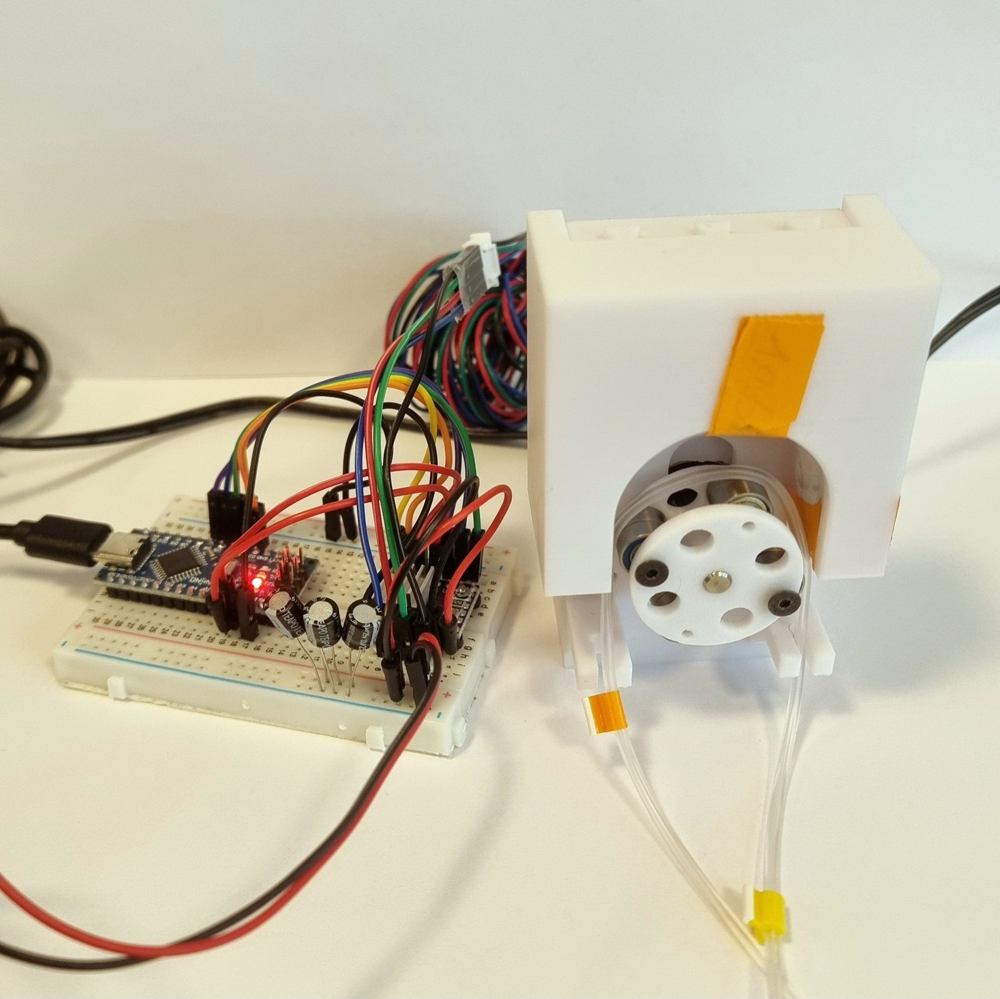

# Build contract for the defense deck

The English host deck at `decks/thesis-defense/index.html`, built 2026-09-20 for the defense on 2026-09-28. Read `BRIEF.md` (requirements and decisions), `CONTENT.md` (the 43 slides, section H motion notes, section L dialect map) and `SKILL-NOTES.md` first. The three previews in `previews/` are working references for the three dialects; open their source.

**Creativity is required, not optional.** Sirio said he will be disappointed if only the three preview concepts are used. Every part must contain at least two compositions or motion concepts that are not in the previews, invented from that slide's own material. Section H of CONTENT.md is a starting point; improve on it.

## Source layout and assembly

The served file is a single self-contained `index.html`. It is assembled from parts so that several builders can work in parallel and later edits stay local:

```
decks/thesis-defense/
  parts/00-head.html        doctype, head, shared CSS, frame markup, opening of .deck-stage (infra)
  parts/10-opening.html     S01 to S04                                (builder P1)
  parts/20-part1.html       S05 to S10                                (builder P1)
  parts/30-part2.html       S11 to S24                                (builder P2)
  parts/40-part3.html       S25 to S36                                (builder P3)
  parts/50-discussion.html  S37 to S43                                (builder P4)
  parts/60-backups.html     B01 to B23                                (builder P4)
  parts/99-tail.html        close of stage, HUD, presenter and guest panels, scripts (infra)
  assemble.py               concatenates parts in name order into index.html; run with the anaconda python
  index.html                the output; never edited by hand
```

Each part file is a plain HTML fragment: its `<section class="slide">` elements, then optionally one `<style data-part="…">` and one `<script data-part="…">` block for slide-specific CSS and timelines. The assembler moves every `<style data-part>` into the head and every `<script data-part>` before the closing body tag, in part order, so builders never touch the head or tail. Builders write only their own part file and their screenshots.

## Slide markup

```html
<section class="slide" id="s16" data-cue="s16" data-dialect="sheet" data-part="II" data-accent="pump">
  <h2 class="slide__title">Three more builds fixed the printing, not the physics.</h2>
  <!-- slide content; media use data-src -->
  
  <video class="…" data-src="../../assets/media/video/pump-head.mp4" poster="../../assets/media/video/pump-head-poster.jpg" muted loop playsinline preload="none"></video>
  <div class="fragment" data-step="1"></div> <!-- steps are invisible markers; the timeline does the visuals -->
  <div class="fragment" data-step="2"></div>
  <aside class="notes">
    <ul><li>…</li><li>…</li></ul>
  </aside>
</section>
```

- `id` and `data-cue` are `s01` to `s43` and `b01` to `b23`, fixed by CONTENT.md; the Italian deck reuses them.
- `data-dialect`: `sheet`, `cards`, `cine`, or a new name the builder invents (document it in the part's style block comment).
- `data-part`: `open`, `I`, `II`, `III`, `demo`, `disc`, `close`, `backup`. Drives the mini map.
- `data-accent`: `pump`, `align`, `nozzle`, or absent. Sets the thread colour on that slide only.
- Steps: one `.fragment` marker per clicker step, in order. The runtime reveals them; the infra script watches them and drives the slide's timeline to label `step1`, `step2`, … Builders may also put content inside `.fragment` elements when a plain CSS reveal is enough (the runtime's own fade), but the timeline is the primary mechanism.
- `aside.notes`: two to four short bullets, the "Say" line expanded; shown only in the presenter view.
- Media: `data-src` on `img`, `video`, `iframe`; the infra script swaps in `src` on slide entry with one-slide lookahead and clears it when more than two slides away. Videos autoplay on entry, pause on leave, `data-sound` on a video means it plays unmuted (only the longest on a slide). Posters always present.
- Tool cards: `<div class="tool-card" data-tool="rotor" data-src="../../tools/rotor-solver/index.html" data-poster="assets/posters/rotor-solver.png"><span class="tool-card__name">Rotor Geometry Solver</span><span class="tool-card__line">…</span></div>`. The infra script makes it clickable: it grows to fill the stage, loads the iframe if not yet loaded, hands focus to it; Escape or a click on the edge shrinks it back and the deck keys work again. Posters: the builder takes a screenshot of the tool at 1280 by 800 with Playwright and saves it under `assets/posters/`.
- Text on screen: title, labels, numbers, kickers, the scene beats and the quotations only. No bullet lists on the stage (they live in `aside.notes`). Nothing below 18 px at stage size. No internal labels (no step numbers, dialect names, file names).
- Dividers: `<section class="slide slide--divider" data-part="II">` with the part numeral and title; the infra CSS styles them; the water wash brightening is infra.

## Timelines

Each slide that animates registers one builder:

```js
Deck.slide('s16', function (el, gsap) {
  const tl = gsap.timeline({ paused: true });
  tl.addLabel('step0');
  // … tweens …
  tl.addLabel('step1');
  // …
  return tl;   // labels step0..stepN, N = number of .fragment markers in the slide
});
```

The infra calls the builder once, lazily, on first entry of the slide (after the media for that slide has its `src`), keeps the timeline, and on each fragment change plays `tl.tweenTo('step'+n)` (or `tl.seek` under reduced motion). On slide entry with all fragments already revealed (going backwards) it seeks to the last label. Entrance motion that should play on every entry (not tied to a step) goes in a `Deck.enter('s16', fn)` hook, replayed each time the slide becomes active. GSAP core, DrawSVG, MotionPath and MorphSVG are loaded by the tail from `../../assets/gsap/`; builders use them freely; no other libraries.

## Shared components the head provides (infra writes, builders use)

- Tokens: the site's (`--display`, `--mono`, `--ease`, `--dur`, `--dur-fast`, `--dur-slow: 1200ms`, `--r-lg`, `--r-md`, `--r-sm`, `--glass-bg`, `--glass-border`, `--text`, `--muted`, `--accent`), plus thread accents set by `[data-accent]` on the slide (`--t-a`, `--t-b`: pump `#ff6b2b/#e83535`, align `#9b7fe0/#5a8fd8`, nozzle `#4fb3c8/#3a7bd5`).
- `.slide__title`: Geist Bold, 44 to 52 px, top left, two lines max, the same position on every content slide.
- Dialect A classes from `previews/a.html`: `.sheet`, `.sheet__main`, `.sheet__rail`, `.sheet__panel`, `.sheet__num`, `.sheet__label`, `.sheet__timeline`.
- Dialect C classes from `previews/c.html`: `.pile`, `.card`, `.card__kicker`, `.card__media`, `.card__num`, `.card__label`, `.paper` (the warm paper frame `#f6f3f0` for figures drawn for print).
- Dialect B classes from `previews/b.html`: `.cine`, `.cine__img`, `.cine__scrim`, `.cine__num`, `.cine__label`, `.cine__strip`. The scrim is lighter than in the preview (image brighter); expose `--cine-scrim` so a slide can set it.
- `.num` (mono, tabular), `.kicker` (14 px letter-spaced small caps), `.callout` and `.leader` (leader-line callouts on a photo, drawn with DrawSVG), `.minimap` (the site's line mark, rotor node lit by `data-part` and `data-accent`; infra renders it once, outside the slides, and updates it on slide change).
- The corner nav (`.site-nav--deck`) fades out after 3 s without mouse movement and returns on movement; it also hides in the presenter and guest views.
- `.deck-hud`: progress bar and counter, faint, from `deck.css`.

## Runtime additions (infra, in `assets/deck.js`, additive only)

Append inside the IIFE, before the init block, and call `emitState()` at the end of `goToSlide`, and in `advance` and `retreat` after a fragment change:

- `window.Deck` with getters `slide`, `step`, `count`, `steps` (fragments on the current slide), `cue` (the current slide's `data-cue`), and methods `goToState(slide, step, remote)`, `goToCue(cue, step, remote)`, `advance()`, `retreat()`, `overview()`, `slide(cue, builderFn)`, `enter(cue, fn)`.
- `deck:state` CustomEvent on `document` after every navigation, `detail: { slide, step, cue, count, steps, remote }`.
- Hash `#/<slide>/<step>` read on load and on `hashchange`, written with `replaceState`.
- `PageUp`, `PageDown`, `Home`, `End` keys; `b` for blackout (a black overlay, toggled); `f` for fullscreen; number keys jump to a slide by typing digits then Enter. `Escape` closes the Instruments panel if open and otherwise toggles the overview (the panel check goes at the top of the key handler).
- Overview clones: replace `video` with an `img` of its poster and skip `iframe` (already a placeholder).
- Everything else in `deck.js` untouched. `deck.css` untouched (deck-local CSS overrides in the head).

## Three views, one file (infra, in the tail script)

`index.html?view=stage` (default), `?view=presenter`, `?view=guest` (the guest view is used by `it/index.html` later; build it in the host file so it can be tested with English content).

- **stage**: the deck as is.
- **presenter**: the stage is scaled into a panel at the top left (about 55 % width); to its right the next step preview (a clone of the next slide with all fragments revealed if the next step is a slide change, else the current slide with the next fragment revealed, scaled small, refreshed on each state change); below, the current slide's `aside.notes` rendered large (22 px), the slide counter, a clock, an elapsed timer that starts on the first key press and can be reset with `r`, and the remaining-time hint against a 25-minute plan plus the 5-minute demo. Keys in the presenter window drive the deck; the stage window follows over BroadcastChannel.
- **guest**: no nav, no HUD, the deck fills the window, keyboard still works, and the sync client applies incoming states. A small "seguiamo" dot top right shows green when a message arrived in the last 20 s.

Sync (`?sync=host` on the stage or presenter window, `?sync=guest` on the guest): the ntfy.sh design from BRIEF.md section 7, plus BroadcastChannel `deck:thesis-defense` unconditionally. Message `{ v:1, deck:'thesis-defense', sid, cue, step, seq, t }`. Host posts to `https://ntfy.sh/<topic>` coalesced 120 ms and heartbeats every 15 s; guest subscribes to `/sse?since=2m` and applies by `cue`. The topic is `sirio-defense-2026-09-28-` followed by a random 8-character suffix stored in `sync.js`… no: keep it simple, the topic is a constant in the tail script, `svf-defense-20260928-k7q2m9x4`. The deck with no `sync` parameter makes no network call. Both directions of BroadcastChannel apply states, guarded by `sid` and `seq`, so presenter and stage windows on one laptop stay in step whichever has focus.

## Registration and docs (after the slides)

- `decks/index.html`: one `.deck-card` for the defense, date 2026-09-28, title "Thesis Defense", one line of contents, `--card-angle` and `--delay` following the existing card.
- `decks/thesis-defense/SPEC.md`: runtime structure, the parts and assembly, the state API, the three views, the sync protocol, the tools embedded, the media used, what is real and what is staged.
- `README.md` deck row updated; `CLAUDE.md` folder entry updated.

## Verification (every builder, then the final pass)

Serve with `python -m http.server 7331` from the repo root if `http://localhost:7331/` does not answer. Open the assembled `index.html` (run `assemble.py` first) in the Playwright MCP browser in your own tab; go to your first slide with the hash; step through every step of every one of your slides with the right arrow, screenshot each step at 1280 by 720 into `screens/<cue>-<step>.png`, and look at them. Check: no text overflow, no overlap, nothing below 18 px, media loaded, console free of errors, going backwards restores the state, reduced motion jumps to the end state. Note the headless browser throttles requestAnimationFrame; call `gsap.ticker.lagSmoothing(0)` from the console at test time only, never in the file. The shared browser's "current tab" is global to all agents: resolve your page by URL with `browser_run_code_unsafe` and drive it directly, as the preview C builder did.
