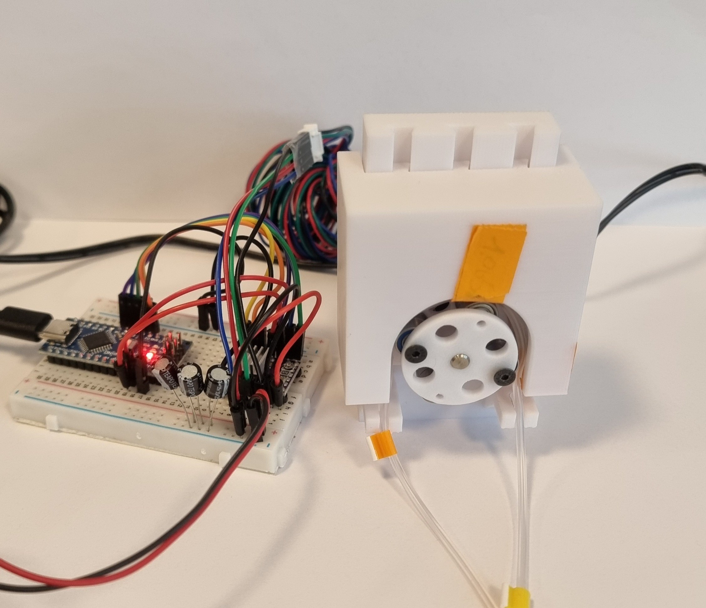
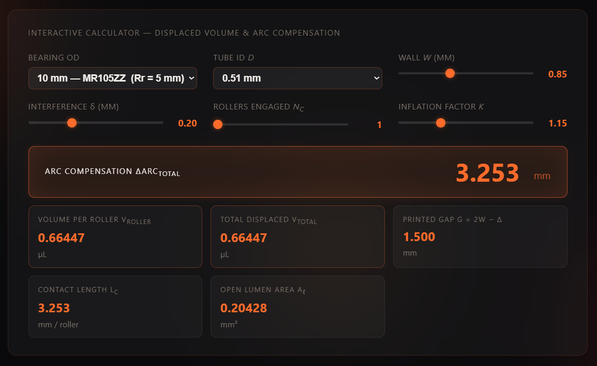
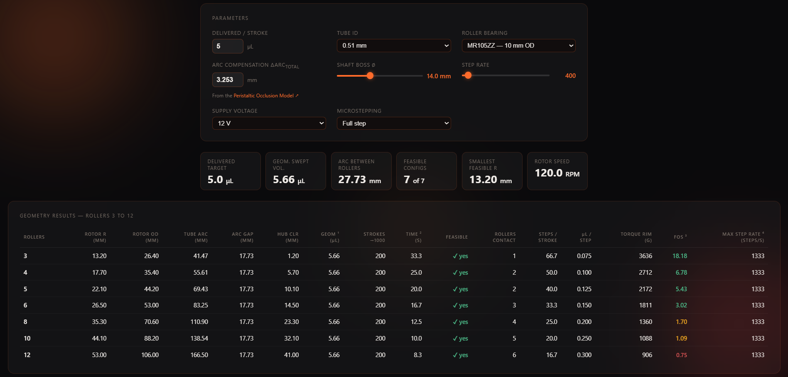
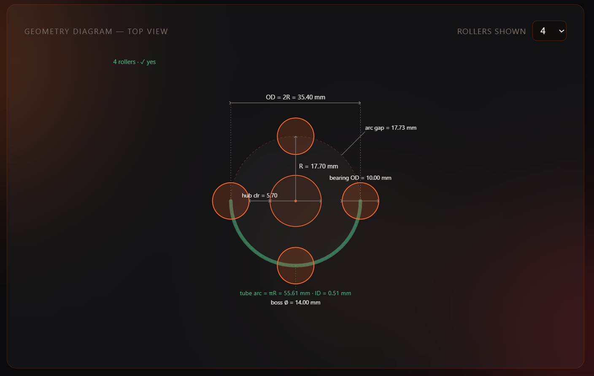
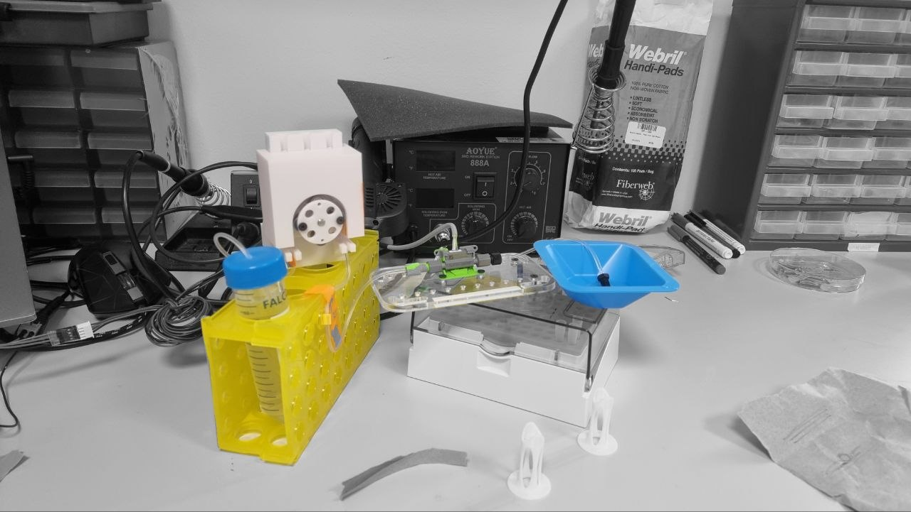

# Prototype 1 — 5 µL 4-roller peristaltic (baseline)

The first physical build. Its job was never to hit spec — it was to **test whether
the concept is buildable, whether the geometric model I built is correct, and to
extract as much learning as possible before committing to the next design cycle.**
On all three counts it succeeded: it pumps, the model predicts the (messy) reality
to within ~11 %, and it exposed three concrete, fixable design errors. **Redesign
(proto-02) is decided.**



---

## 1. Why this prototype existed (purpose)

- **Prove the concept.** Can a peristaltic pump actually be built in this
  modular, 3D-printed, point-of-care form factor, and does it move liquid?
- **Validate the model.** I had spent a lot of time on the
  [Peristaltic Roller Occlusion & Displaced-Volume Model](../../../tools/peristaltic-roller-displaced-volume-model/index.html)
  and the [Rotor Geometry Solver](../../../tools/rotor-solver/index.html). I wanted a
  physical object to check the modelling against — to see if how I had modelled the
  system was right.
- **Learn before the next cycle.** I had been thinking in the abstract for a long
  time and needed a physical version to learn from, to surface the problems that
  only appear once something exists in your hands.

This is a **minimum viable prototype**: built to detect systematic error, not to
pass acceptance.

---

## 1a. Parts & assembly — the physical build

Five components: four printed parts, the roller bearings, and the tube. **proto-02 reuses the
same set** (edited, not redesigned), so this is the canonical parts description for the whole
pump line.

| # | Part | What it is / does |
|---|------|-------------------|
| 1 | **NEMA17 motor holder** | L-bracket. A central bore passes the motor shaft (motor bolts to the back). The top edge carries **dovetail-female channels** that guide the pump head straight **down** to a **hard stop** — the stop fixes seat depth and keeps the head off the rotor. **No mounting provision** — the holder is free-standing on the bench and was never fixed to anything, on proto-01 or on any later build. *(Corrected 2026-08-30: an earlier version of this row read “base feet with slots for mounting”. Those do not exist. The claim reached the thesis as a third module interface in §6.4.3 and was cut on the student's reading; the pump module presents a fluid path and a step/direction drive, and nothing mechanical.)* |
| 2 | **Rotor** — RotorMain + RotorCover | A disk on the motor shaft (keyed shaft hole). Holds the rollers in **4 pockets at 90°**; RotorCover caps them in (M3 screws join the two halves). The radius to the **bearing outer surface** is the working roller radius `R`. |
| 3 | **Roller bearings — 8 × MR105ZZ** (10 mm OD) | **Two bearings stacked per roller position** (4 positions × 2 = **8 total**). A single MR105ZZ is not wide enough to span the tube contact, so they are doubled up for width. Radius is unchanged (`R_r` = 5 mm). |
| 4 | **Pump head** | Carries the **semicircular 180° occlusion wall**. Slides down the holder's dovetail and bottoms on the hard stop. The arch wraps the **top** ~180° of the rotor; the tube routes up and **over the top**. |
| — | **Tube** | **Masterflex** 2-stop microbore (Puri-Clear LL, 0.51 mm ID), bought through **Darwin Microfluidics** (the reseller — see §3). Squeezed between rollers and wall. |

**How it works.** Motor on the holder → shaft through the bore → rotor on the shaft with its 8
bearings (4 roller positions) → pump head slides down the dovetail over the **top** of the rotor
and bottoms on the hard stop → tube threaded into the gap. The motor spins the rotor; the rollers
sweep the top 180° arc, each pressing the tube against the wall → peristaltic delivery.

> **proto-01-specific:** there was **no head lock** (the head had to be held down by hand) and
> **no way to measure the installed gap** — only the nominal CAD value was known (see §5a). Both
> are fixed in proto-02.

---

## 2. Nomenclature — every symbol used below

| Symbol | Meaning | Value (proto-01) | Unit |
|--------|---------|------------------|------|
| `d` | Tube **inner** diameter (the lumen that carries liquid) | 0.51 | mm |
| `w` | Tube **wall** thickness (one wall) | 0.85 *(estimated)* | mm |
| `A` | Lumen cross-section area `= π(d/2)²` | 0.2043 | mm² |
| `R_r` | Roller radius (MR105ZZ bearing, 10 mm OD — 2 stacked per roller, 8 total) | 5.0 | mm |
| `δ` (delta) | Radial **interference** — how far the roller closes *past* the point where the walls first touch. Higher δ = harder squeeze. | 0.20 *(design)* | mm |
| `k` | **Inflation factor** — empirical correction (>1) because a real tube contacts over a longer length than the ideal-geometry prediction (Klespitz & Kovács 2022) | 1.15 | — |
| `G` | **Printed gap** between roller surface and the backing wall `= 2w − δ` | see §5 | mm |
| `N_c` | Number of rollers **simultaneously occluding** the tube at any instant | should be **2** | — |
| `N` | Total **roller count** on the rotor | 4 | — |
| `L_c` | **Axial contact length** of one roller's squeeze footprint along the tube `= k · 2√(2 R_r δ)` | see §4 | mm |
| `ΔArc_total` | **Arc compensation** — extra tube arc each stroke must sweep to make up for the lumen length the rollers pinch shut (occluded, so it delivers nothing) `= N_c · L_c` | see §4 | mm |
| `vol` | **Target** delivered volume per stroke | 5.0 | µL |
| `arcNeeded` | Tube arc one roller must sweep per stroke `= vol/A + ΔArc_total` | see §4 | mm |
| `geomVol` | **Gross** geometric swept volume `= arcNeeded · A` | see §4 | µL |
| `R` | **Rotor radius** `= N · arcNeeded / (2π)` | see §4 | mm |

> **The two tools and how they connect:** the **Displaced-Volume Model** takes the
> tube/roller mechanics (`d, w, R_r, δ, k, N_c`) and outputs `L_c` and
> `ΔArc_total`. That `ΔArc_total` is then **pasted into the Rotor Solver**, which
> adds it to the pure delivery arc (`vol/A`) and solves the rotor radius `R`. So an
> error in `N_c` or `δ` in the first tool propagates directly into the **physical
> rotor size** produced by the second. This coupling is the source of two of the
> three errors below.

---

## 3. As-built design parameters — and why each was chosen

| Parameter | Value | Why this value |
|-----------|-------|----------------|
| Target volume per stroke | 5.0 µL | Smallest aliquot the dispensing application targets |
| Roller count `N` | 4 | Fewest hand-offs for discrete dosing (see §3a) |
| Rollers engaged `N_c` **(as entered)** | **1** ← *should have been 2* | Mistake — a 180° arc with 4 rollers always has 2 engaged |
| Tube inner diameter `d` | 0.51 mm | Smallest 2-stop microbore giving a workable rotor size |
| Tube wall `w` | 0.85 mm *(estimated — see §8)* | From a **similar** tube (online) + caliper check; exact model wall not published |
| Roller bearings | 8 × MR105ZZ, 10 mm OD (`R_r` = 5 mm) — **2 stacked per roller** | A single bearing isn't wide enough to span the tube → doubled for contact width. Compact standard shielded bearing → small rotor |
| Interference `δ` (design) | 0.20 mm | Mid of the 10–20 % × 2w occlusion band |
| Inflation factor `k` | 1.15 | Compliant-tube correction (Klespitz & Kovács 2022) |
| Rotor radius `R` (as built) | 17.70 mm | Rotor solver output (carries the `N_c`=1 error) |
| Designed gap `G` (CAD) | **1.75 mm** ← *should have been ≈1.50 mm* | **Nominal only — proto-01 had no way to measure the installed gap.** Tool's gap not carried into CAD (see §5) |
| Loose-fit tolerance (pump-head slot) | 0.25 mm | Too loose → head wobble |
| Steps per stroke (firmware) | 50 (200 steps/rev ÷ 4 rollers) | `manual_dispense.cpp` |

> **Tube:** a **Masterflex** 2-stop microbore (Puri-Clear LL, 0.51 mm ID), platinum-cured silicone,
> bought through [Darwin Microfluidics](https://darwin-microfluidics.com/products/2-stop-puri-clear-ll-pump-tubing-pack-of-12)
> — **Darwin is the reseller, the tube is Masterflex.**

### 3a. Key design decision — why 4 rollers

4 rollers was selected over higher counts even though continuous-flow practice
(Cole-Parmer, Ismatec) recommends 8–10 rollers for low-flow accuracy below
5 mL/min. **The distinction is operational mode:**

- Those recommendations target **continuous metering**, where more rollers reduce
  *pulsation*.
- This system does **discrete stop-start aliquot dosing**, where each **roller
  hand-off** (one roller releasing as the next engages) is an **error event** at
  the stop. Fewer rollers → fewer hand-offs per dispense → fewer stop-event error
  opportunities. A 4-roller pump completes ~one hand-off where an 8-roller pump
  completes ~two.

So for discrete dosing, fewer rollers is an *advantage* for stop precision that
higher counts don't offer — the opposite of the continuous-flow heuristic.

> **Honest caveat (for the report):** proto-01's data cannot yet *demonstrate* this
> advantage, because the −32 % systematic occlusion error swamps the hand-off
> signature. The rationale is based on the expected error model for discrete dosing;
> **proto-02 is the first build where it becomes testable** (once occlusion is
> correct, the hand-off contribution should be visible in the CV).

Design screenshots of the two tools at the proto-01 operating point:





---

## 4. The design calculation, fully worked (as it was done)

This is the chain the tools ran. Every line is shown so the whole thing is
readable end-to-end.

**Step 1 — lumen area** (cross-section of the liquid channel):
```
A = π · (d/2)²
  = π · (0.51/2)²
  = π · 0.2550²
  = 0.2043 mm²
```

**Step 2 — contact length of one roller** `L_c = k · 2√(2 R_r δ)`.
This is how long, *along the tube axis*, a single roller's squeeze footprint is.
`√(2 R_r δ)` is the half-width of contact between a cylinder of radius `R_r` pressed
a depth `δ` into a surface (Hertzian-style chord geometry); `×2` makes it the full
width; `×k` inflates it because a real compliant tube touches over a longer span
than the ideal rigid-geometry value.
```
L_c = 1.15 · 2 · √(2 · 5.0 · 0.20)
    = 1.15 · 2 · √2.0
    = 1.15 · 2 · 1.4142
    = 3.253 mm
```

**Step 3 — arc compensation** `ΔArc_total = N_c · L_c`.
Along the contact length `L_c` the roller pinches the tube **shut**, so that segment
of lumen holds no liquid and delivers nothing. The pure delivery arc (`vol/A`)
assumes every mm of swept tube is full, so it over-counts by exactly this occluded
length — the stroke must sweep an extra `L_c` per engaged roller to make up the
shortfall. With **`N_c` entered as 1**:
```
ΔArc_total = 1 · 3.253 = 3.253 mm        ← THIS IS THE FIRST ERROR (should be N_c = 2)
```

**Step 4 — arc each roller must sweep** `arcNeeded = vol/A + ΔArc_total`.
The first term is the *useful* arc that delivers the 5 µL; the second is the
*compensation* arc that is swept but not delivered (it just covers the deformation
loss):
```
arcNeeded = 5.0 / 0.2043 + 3.253
          = 24.48 + 3.253
          = 27.73 mm
```

**Step 5 — gross geometric swept volume** `geomVol = arcNeeded · A`:
```
geomVol = 27.73 · 0.2043 = 5.66 µL
```
> **Is 5.66 µL "out of place"?** No. It is the **gross** sweep, deliberately larger
> than 5.0. The extra `ΔArc_total · A = 0.66 µL` is the delivery lost over the
> pinched-shut contact length (occluded tube delivers nothing).
> `geomVol − ΔArc_total·A = 5.0 µL` net. It is a valid reference because that
> occlusion loss is real — keep it.

**Step 6 — rotor radius** `R = N · arcNeeded / (2π)`.
The rotor is sized so that 4 rollers spaced evenly each sweep `arcNeeded` over the
180° contact arc:
```
R = 4 · 27.73 / (2π)
  = 110.92 / 6.283
  = 17.65 → 17.70 mm   (rounded to 0.1 mm, Bambu P1S print resolution)
```

This `R = 17.70 mm` is the rotor that was actually printed. **The `N_c`=1 error is
now baked into the physical part.**

---

## 5. What actually happened in the hardware

### 5a. The printed gap was wrong: the tube was never occluded

The displaced-volume tool prescribes the gap as `G = 2w − δ`. With `w` = 0.85 mm
and the design `δ` = 0.20 mm that is:
```
G_correct = 2·0.85 − 0.20 = 1.70 − 0.20 = 1.50 mm
```
The part was instead designed with **G = 1.75 mm**. The critical threshold is the
**"walls kiss"** gap, where the tube first fully closes:
```
G_walls-kiss = 2w = 2·0.85 = 1.70 mm
```
**1.75 mm > 1.70 mm** → the gap was *wider than the point of first closure*. By
design, **the rollers never occluded the tube at all** (effective δ ≈ −0.05 mm).
This is the second error, and it is independent of the `N_c` error — I simply did
not follow the tool's gap prescription.

> **Important — the gap was never measured.** 1.75 mm is the **nominal CAD** value;
> proto-01 had **no caliper access / no measurement slots**, so the *installed* gap is
> **unknown**. It can only be **inferred**: with no shim the tube was not squeezed and
> delivered **nothing**, which means the real gap was **≥ the walls-kiss 2w** (and so
> **≥ the nominal**, almost certainly larger). proto-02 adds caliper-access slots precisely
> to remove this blind spot.

> **Honest note for the report:** I did not transfer the tool's `G = 1.50 mm`
> output into the CAD gap; I used 1.75 mm. Combined with the `N_c` mistake, this is
> a *workflow* failure (not reading my own tool's output back into the model),
> which is itself a finding: the design loop needs the tool value carried through
> to CAD explicitly, not re-estimated.

### 5b. The paper-shim fix

Because the tube was not being squeezed, the pump did not pump. To make it work I
**folded paper into the groove** so the tube sat proud and the rollers could reach
it. Measuring the folded paper with a caliper (itself hard — it compresses):

| Pressure on caliper | Paper thickness |
|---------------------|-----------------|
| Light | 1.0 – 1.1 mm (≈1 mm minimum in some sections) |
| Firm | ≈0.85 mm |
| Very hard | ≈0.78 mm |

So the shim raised the tube by roughly **0.8–1.1 mm**, turning the effective gap
from 1.75 mm into something like `1.75 − 0.85 ≈ 0.90 mm` (firm) up to
`1.75 − 0.65 ≈ 1.10 mm` (light). That corresponds to an **effective interference**
`δ_eff = 2w − G_eff`:
```
firm shim:   δ_eff = 1.70 − 0.90 = 0.80 mm   (heavy over-squeeze)
light shim:  δ_eff = 1.70 − 1.10 = 0.60 mm
```

The actual delivery is measured next (§6); the model is then checked against it (§7).

---

## 6. Measured performance (the data)

Manual 1 mL open-loop calibration (2026-06-15), **two measurement methods** —
full report: `03. CODING/manual-dispense-check/proto-01-5ul-4roller/REPORT.md`.

| Method | n | Mean delivered (1 mL cmd) | CV | Implied µL/stroke | Error vs 1 mL |
|--------|---|---------------------------|-----|-------------------|---------------|
| **Gravimetric** (reference) | 3 | **678 µL** | 4.5 % | **3.39** | **−32.2 %** |
| Flow sensor (integrated) | 5 | 600 µL | 17.6 % | 3.00 | −40.0 % |

- The assumed 5.0 µL/stroke is wrong — the true rate is **≈3.4 µL/stroke**
  (gravimetric). The build under-dispenses ~32 %.
- Flow integration reads ~11.5 % below gravimetric (low-flow tails cut by the zero
  threshold + sensor bias). **Trust gravimetric for the absolute number; use flow
  for dynamics** (priming, ripple).



---

## 7. Discussion — does the model predict the result?

Feeding the *actual* occlusion back through the model closes the loop. The rotor was
built at `arcNeeded` = 27.73 mm. The **net** delivered volume is the gross sweep
minus the *actual* arc compensation eaten by the real occlusion:
```
net = (arcNeeded − ΔArc_actual) · A
ΔArc_actual = N_c · L_c(δ_eff),  with the TRUE N_c = 2
```

**Firm-shim case (δ_eff = 0.80 mm):**
```
L_c(0.80)   = 1.15 · 2 · √(2·5·0.80) = 1.15 · 2 · √8 = 6.505 mm
ΔArc_actual = 2 · 6.505 = 13.01 mm
net         = (27.73 − 13.01) · 0.2043
            = 14.72 · 0.2043
            = 3.01 µL
```

**Predicted 3.01 µL vs measured 3.39 µL (gravimetric).** Back-solving the model from
the measured 3.39 µL gives an effective gap of **1.11 mm** — which lands exactly in
the *light-shim* band I measured ("≈1 mm minimum in some sections"). **The model
brackets the real result and predicts the messy shim experiment to within ~11 %.**
For a first-order geometric model fed a hand-folded paper shim of uncontrolled
thickness, that is strong validation that *how I modelled the system is correct*.

### Error budget — accounting for the 5.0 → 3.4 gap

Starting from the **design intent** of 5.0 µL net:

| Mechanism | Contribution | Confidence |
|-----------|-------------:|------------|
| Gap 1.75 mm > walls-kiss 1.70 mm → **zero natural occlusion** (needed the shim to function at all) | the enabling failure | `[Certain]` |
| Shim **over-compressed** the tube (δ_eff ≈ 0.6–0.8 vs design 0.20) → far more arc wasted to deformation | −1.6 to −2.0 µL | `[Likely]` (model-supported) |
| `N_c` = 1 instead of 2 → rotor under-sized by ~2 mm (`R` 17.7 vs 19.7), so even a *correctly occluded* build would have fallen short | ~−0.67 µL | `[Certain]` (derivable) |
| Paper thickness varies 0.78–1.1 mm across sections → stroke-to-stroke inconsistency | drives the CV | `[Very likely]` (measured) |

The deficit is fully explained by geometry + the shim. It is a **systematic**
under-delivery (consistent, CV 4.5 %), not random noise — which is exactly what a
fixed-geometry error looks like.

---

## 8. The wall-thickness measurement problem (a real finding)

`w` is the single most leverage-heavy input — it sets the gap via `G = 2w − δ` —
and it is **the hardest to pin down**:

- The exact 2-stop microbore tube's datasheet **does not cleanly state the wall**.
  The 0.85 mm value comes from an **online check of a similar tube model** (AI
  search; the precise dimensions of this exact one weren't published).
- That estimate was then **checked with a caliper**, which roughly confirmed it —
  though the reading is unreliable because the soft tube compresses under the jaws.

Without any shim the pump delivered **nothing** — consistent with the actual gap being
**≥ 2w** (no occlusion). The hint that `w` may be **above** 0.85 mm comes instead from how
*little* shim was needed to start delivery, and is since confirmed by the proto-02 microscope
measurement (`w` = 0.91 mm). Note the installed gap was never measured on proto-01 (only the
nominal 1.75 mm), so it cannot be combined with `2w` to claim "marginal occlusion" — the
no-delivery result simply says the real gap was too wide. **For proto-02, measure `w` properly** — *preferred: cut a
cross-section and image it under the microscope* (a micrometer on the OD, then
`w = (OD − d)/2`, is the fallback if one is available). This wall-thickness
uncertainty belongs in the report as a **known model limitation**: a critical input
that is both uncertain and difficult to measure at the sub-millimetre scale.

---

## 9. Noise & vibration test (firmware-side, tested on this build)

Proto-01 was **very noisy** with strong vibration — running the DRV8825 driver in
**full step**. I tested whether this could be cut in firmware without a hardware
change, using a purpose-built bench tool.

- **Tool:** `vibration_test.cpp` — live serial control of microstepping and pulse
  rate (no re-flash between tries), runs a repeatable 1.5-cycle move.
  Home: `03. CODING/manual-dispense-check/proto-01-5ul-4roller/firmware/vibration-test/`.
- **Lever:** on a DRV8825 there is no "smoothing library" — the real levers are the
  **acceleration ramp** (already handled by AccelStepper) and **microstepping**
  (finer micro-steps → smoother torque → less audible vibration, at some cost in
  torque and max speed).

**Bench result (2026-06-17) — chosen operating point on the existing DRV8825:**

| Parameter | Value |
|-----------|-------|
| Microstepping | **1/4** |
| Pulse rate | **2400 steps/s** |
| Rotational speed | **3.0 rev/s = 180 RPM** |
| Driver | DRV8825 (unchanged) |
| Verdict | **best noise-vs-torque compromise** — quiet/smooth enough, torque margin kept |

Why it lands well: 1/4 step removes most of the harsh full-step vibration while the
torque penalty is still small (unlike very fine steps), so step-skip risk under the
2-roller load stays low; 2400 steps/s sits comfortably inside the Arduino Nano's
~4000 steps/s AccelStepper ceiling. **A silent driver (TMC2209/2226) is the
fallback** if more silence is ever needed, but it costs torque on this torque-hungry
(2 rollers engaged), open-loop pump — see `driver-comparison.md` for the full
analysis. **Finding:** full-step is the noise source; **1/4 microstepping at
~180 RPM is the recommended manual operating point**, free, no parts.

> Open-loop caveat captured here for proto-02: a skipped step is *silent and
> uncorrected* → it becomes a volume error. We already under-dispense, so step loss
> matters. StallGuard (TMC2209) could later turn the open loop load-aware.

---

## 10. Issues observed (the physical reality)

1. **Tube not squeezed enough** — gap too wide (§5a); needed a paper shim in the
   groove to function at all. *The headline mechanical failure.*
2. **Under-delivery** — ≈3.4 µL vs 5.0 µL target, −32 % (§6).
3. **Pump head not fixed** — I had to **hold the head down by hand** during
   delivery; there was no mechanism to lock it in place.
4. **Wobble** — the 0.25 mm loose-fit tolerance on the head slot let the head move;
   since the head position *is* the gap, wobble directly modulates occlusion.
5. **Noisy / strong vibration** — full-step DRV8825 (addressed in §9).

---

## 11. Improvements → inputs for proto-02

These are the concrete, agreed changes the next prototype must carry. **This
section is the design brief for proto-02.**

### Geometry
- **Fix `N_c` to 2** in the displaced-volume model (4 rollers, 180° arc → 2 always
  engaged). Re-derive `ΔArc_total` (≈6.51 mm at δ=0.20) and feed it into the rotor
  solver → **rotor radius grows ~17.7 → ~19.7 mm.**
- **Carry the tool's gap prescription into CAD.** Target `G = 2w − δ`. Because `w`
  is uncertain, **print a small sweep of pump heads** spanning the gap, e.g.
  `G ≈ 1.35 / 1.50 / 1.65 mm` (covers `w` ≈ 0.78–0.93 mm at δ≈0.20), measure
  delivery per head → directly maps gap → output **and** reveals the true `w`.
  *This requires the head to be lockable (below) or the result is meaningless.*

### Tube installation (3 points)
1. **Reposition the tube holders** so the tube sits under *minimal* stretch (not
   over-tensioned, not slack).
2. **Tighten the holder holes** so the tube, once seated, will not pop back out.
3. **Add a shield/retainer** that stops the tube from falling behind the rollers.

### Pump-head fixation
- Add a **positive lock** — screw clamp (simplest) or a cam/lever mechanism
  (faster to operate). **Not optional:** it is what makes the gap repeatable and
  what makes the multi-head gap sweep above measurable.

### Tolerance
- Reduce the loose-fit clearance from **0.25 → ~0.10 mm**, *paired with* the lock.
  0.10 mm lets the head slide in without wobble; the lock removes the remaining
  slack during operation (0.10 mm clearance can still creep under vibration alone).

### Firmware
- Adopt **1/4 microstepping @ ~2400 steps/s (180 RPM)** as the default operating
  point (port the §9 setting into the production firmware) to cut noise/vibration.
- Recalibrate steps/stroke against the new geometry.

### Model / calibration (do *after* the hardware is fixed, not before)
- **Measure `w` properly first** — *preferred: microscope cross-section* (micrometer
  OD then `w = (OD − d)/2` is the fallback if one is available) — before re-running
  the tools.
- **Do not change `k` yet.** Proto-01's shortfall mixes two causes (the `N_c` error
  and the over-squeezed shim), so it cannot isolate the true `k`. Once proto-02
  occludes correctly and is measured clean, **back-calculate the effective `k`**
  from the residual error — only then is 1.15 confirmed or corrected for this tube.

---

## 12. Open questions for future prototypes

- **Other tube IDs?** Worth exploring once the gap/occlusion loop is closed — a
  larger ID raises volume/stroke and could relax the geometry, but changes the
  compression load and torque demand.
- **Keep 4 rollers?** Current reasoning: yes (rationale in §3a). Proto-02 will be the
  first build that can actually *test* the roller-count rationale, because proto-01's
  systematic occlusion error masks the handoff contribution entirely.
- **Pump-head clearance as a tunable:** the multi-head gap sweep (§11) is itself a
  small experiment — "how much space should there be between rollers and head?" —
  enabled by the head-lock. Natural hand-off to `plan-the-test`.

---

## 13. Visual record

| Image | What it shows |
|-------|---------------|
| `Prototype1_Real_Closed.jpg` | The built pump, head closed |
| `Prototype1_Real_Open.jpg` | The built pump, head open (rotor/rollers visible) |
| `Prototype1_Render_Closed.png` | CAD render, closed |
| `Prototype1_Render_Open.png` | CAD render, open (cut-away of the head channel) |
| `Prototype1_FullCircuit_BWColoredRelevant.jpg` | Full electronics/circuit test setup |
| `Prototype1_Displaced_Volume_Tool.png` | Displaced-volume model at the proto-01 point |
| `Prototype1_Rotor_Geometry_Solver.png` | Rotor solver, 4-roller row |
| `Prototype1_Geometry_Diagram.png` | Rotor geometry top-view diagram |

---

## 14. Test data (forward links → 03. CODING)

- Calibration / manual check:
  `03. CODING/manual-dispense-check/proto-01-5ul-4roller/` (report: `REPORT.md`)
- Vibration / noise:
  `03. CODING/manual-dispense-check/proto-01-5ul-4roller/firmware/vibration-test/`
  (`README.md`, `driver-comparison.md`, `vibration_test.cpp`)
- Lab sessions: `03. CODING/lab-data/` — link the specific `phase-*/SESSION.md`
  once a session is run against this prototype.

> Reciprocal link: add a "Prototype: proto-01" line to the relevant `SESSION.md`.

---

## 15. Version log

- **v1 (this build)** — 5 µL/stroke target, measured ≈3.4 (gravimetric). Three
  errors found: `N_c`=1 (should be 2), gap 1.75 mm (should be ≈1.50, no occlusion),
  loose 0.25 mm tolerance + no head lock. Redesign decided.
- **v2 (planned, proto-02)** — `N_c`=2, gap sweep around `2w − δ`, head lock,
  0.10 mm tolerance, tube-retention fixes, 1/4-step firmware. Brief in §11.
