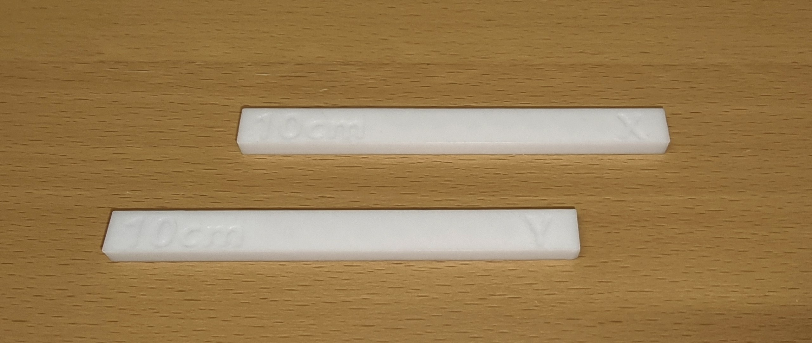

# Prototype 2 — 5 µL 4-roller peristaltic (corrected geometry + gap sweep)

The first build that is meant to **actually work to spec**. Proto-01 proved the concept and
validated the model but carried three known, fixable errors and never occluded the tube
without a hand-folded paper shim. Proto-02 corrects all three, makes the gap a **measured,
locked, repeatable** quantity, and runs a proper statistical characterization (n = 10) to
pin down the two remaining model unknowns — the true tube wall `w` and the inflation
factor `k`.

> **This is a correction-and-characterization build, not an open research question.** The
> design space is largely fixed by the proto-01 diagnosis; the work is executing the fixes
> cleanly and measuring carefully.

---

## ▣ Version status

| Version | State | Where |
|---------|-------|-------|
| 🟥 **v2.1** | **BUILT — did not seal** (partial occlusion, diagnosed) | §11 |
| 🟧 **v2.2** | **ROTOR DONE ✅ — head in design.** Rotor print #2 hits **2R = 39.40 (R = 19.70)**, on target, play-free (single bearing per roller). `NozzleComp` calibrated. Remaining: pump head — wall radius **21.41**, centre on shaft, clear the flange groove, enlarge gap access. **Print the FIRM head alone first** and measure the installed gap. | §11.7.11–15 |
| ⬜ **v2.3** | future — first clean seal + gap sweep | — |

---

## 0. Parts & assembly — what changed from proto-01

The pump is **four printed parts + 8 bearings + the tube**. For the full breakdown of each part
and how the pump assembles, see **[proto-01 §1a](../proto-01-5ul-4roller/PROTOTYPE.md)** — the same
set carries over. proto-02 **edits** them as follows:

| Part | Change from proto-01 |
|------|----------------------|
| **NEMA17 motor holder** | **Unchanged — reused as the fixed reference / datum** (not reprinted; see §11.5). |
| **Rotor** (Main + Cover) | Radius `R` recomputed **17.7 → 19.7 mm** (N_c fix, §5). **Planned for 2.2:** tighter bearing pockets + PLA-shrink compensation (§11.4–11.6). |
| **Bearings** (8 × MR105ZZ, 2 stacked per roller) | Unchanged. |
| **Pump head** | **Gap-sweep heads** 1.52 / 1.62 / 1.72 mm (§6); **caliper-access slots** added to read the installed gap; **screw-clamp lock** added; sliding fit 0.15–0.20 mm/side. |
| **Tube** (Masterflex, via Darwin reseller) | Unchanged; wall `w` now **measured** 0.91 mm (was estimated 0.85). |

**The one datum that matters: the shaft.** It locates every part and cannot be moved, so **all
geometry is referenced to the shaft centre.** **Installed gap = wall radius − `R`**, which should be
**uniform around the arc** (wall concentric with the shaft). Non-uniformity means the wall is not
centred on the shaft — the lens for reading the proto-2.1 measurements in §11.

---

## 1. Purpose

- **Hit a known, acceptable volume.** Deliver ~5 µL/stroke (ideally 5.0), but — equally
  acceptable — deliver a *consistent, known* volume that can be **calibrated by step count**.
  Because the device spec is **±10 %, not more than ±10 µL** over an accumulated dispense,
  the binding requirement is **low stroke-to-stroke CV**, not a perfect mean. A pump that
  reliably gives 5.2 µL/stroke is fine: command 192 strokes instead of 200.
- **Fix the three proto-01 errors** (N_c, gap, head lock — see §4).
- **Make the gap a measured quantity.** Add caliper-access slots to the pump head so the
  *real* installed gap can be read, not inferred from the nominal CAD dimension.
- **Pin down `w` and `k`.** Measure the tube wall properly *before* testing; back-calculate
  the effective `k` from clean post-fix data (proto-01 could not — two error sources were
  confounded).
- **Understand the gravimetric-vs-flow gap.** With a solid, correctly-occluding build,
  investigate *why* gravimetric reads higher than the integrated flow sensor (low-flow
  tails, zero-threshold cutoff, sensor bias) — a measurement-method finding in its own right.

---

## 2. Targets & pass criteria (the explicit goal)

| Quantity | Target | Notes |
|----------|--------|-------|
| Mean volume / stroke | ~5.0 µL (≥ ~4.5 acceptable) | Exact value less important than *knowing* it |
| **Stroke-to-stroke CV** | **≤ 5 %** (stretch ≤ 3 %) | At CV 5 %, σ over 200 strokes ≈ ±7 µL (95 %) → inside the ±10 µL cap. **This is the real pass gate.** |
| Mean known to | ~±2 % | So step-count calibration lands the accumulated volume inside ±10 % / ±10 µL |
| Head-lock gap repeatability | gap drift < 0.10 mm over 10 reinstalls | If it drifts more, the lock is the error source, not the gap |

> Benchmark context: a good **pipette** at 5 µL holds CV ≈ 1.5–3 % (ISO 8655). The device
> *replaces a person pipetting by hand*, so the pipette is the fair comparator. Proto-01 was
> already CV 4.5 % despite its errors. See `.planning/notes/2026-06-17-dispensing-accuracy-standards.md`.

---

## 3. Parameters — as designed (inputs for the build)

Corrected with the [Rotor Geometry Solver](../../../tools/rotor-solver/index.html) and the
[Displaced-Volume Model](../../../tools/peristaltic-roller-displaced-volume-model/index.html),
now with **N_c = 2**.

| Parameter | Value | Why / change from proto-01 |
|-----------|-------|----------------------------|
| Target volume / stroke | 5.0 µL | Unchanged |
| Roller count `N` | 4 | Unchanged — discrete-dosing rationale (proto-01 §3a); proto-02 is the first build that can *test* it |
| **Rollers engaged `N_c`** | **2** | **FIXED** — 180° arc with 4 rollers always has 2 engaged (was wrongly 1) |
| Tube inner diameter `d` | 0.51 mm | Unchanged (Darwin 2-stop Puri-Clear LL) |
| Tube wall `w` | **0.91 mm** (measured) | Microscope + caliper-OD + ISO/Ismatec standard all converge, 2026-06-22 — confirms proto-01's w≈0.90 inference. See `../Tube OD Thikness/tube-wall-thickness-analysis.md` |
| Walls-kiss `2w` / OD | **2w = 1.82 mm · OD = 2.33 mm** | `2w = OD − ID = 2.33 − 0.51`; matches Ismatec standard exactly; sets gap `G = 2w − δ` |
| Roller bearing | MR105ZZ, 10 mm OD (`R_r` = 5 mm) | Unchanged |
| Interference `δ` (nominal) | 0.20 mm | Unchanged design point |
| Inflation factor `k` | 1.15 (provisional) | **Do not change yet** — back-calculate from clean proto-02 data |
| **Rotor radius `R`** | **≈ 19.7 mm** | **Recomputed** with N_c = 2 (was 17.70) — see §5 |
| **Gap `G` — head sweep** | **1.72 / 1.62 / 1.52 mm** (target installed) | **NEW** — 3 heads at δ = 0.10/0.20/0.30, `G = 2w − δ` with measured 2w = 1.82; CAD nominal +FDM offset (see §6–§7) |
| Head lock | **screw clamp** (provisional) | **NEW** — simplest to test; final mechanism chosen after params settle |
| Loose-fit tolerance | **0.15–0.20 mm/side** | Was 0.25; **revised up from 0.10** — FDM undersizing makes 0.10 mm print as near-zero/interference (won't slide). Sliding fit for insertion, lock removes play. See §7 |
| Steps / stroke (firmware) | recalibrate to new `R` | Was 50; re-derive for the larger rotor |
| Microstepping / speed | 1/4 step @ 2400 steps/s (180 RPM) | Port the proto-01 §9 bench result into production firmware |

---

## 4. What proto-02 fixes (drivers from the proto-01 diagnosis)

1. **`N_c` = 1 → 2.** Rotor was undersized by ~2 mm. Corrected to R ≈ 19.7 mm.
2. **Gap never occluded (1.75 > 1.70 mm walls-kiss).** Now a deliberate, *measured* gap
   sweep around `2w − δ`, with caliper-access slots to read the installed value.
3. **No head lock + 0.25 mm wobble.** Screw clamp + 0.10 mm fit → the gap becomes
   repeatable, which is what makes the gap sweep meaningful at all.

Plus the tube-installation fixes (reposition holders, tighten holes, add a retainer shield)
and the firmware noise fix (1/4 step). Full brief: proto-01 `PROTOTYPE.md` §11.

---

## 5. Corrected geometry calculation

With **N_c = 2**, δ = 0.20 mm, k = 1.15, d = 0.51 mm, R_r = 5 mm, vol = 5.0 µL:

```
A     = π(d/2)²            = 0.2043 mm²
L_c   = k·2√(2 R_r δ)      = 1.15·2·√(2·5·0.20)   = 3.253 mm
ΔArc  = N_c · L_c          = 2 · 3.253            = 6.506 mm   ← was 3.253 (N_c=1)
arc   = vol/A + ΔArc       = 24.48 + 6.506        = 30.98 mm
geomVol = arc · A          = 30.98 · 0.2043       = 6.33 µL (gross; net 5.0)
R     = N · arc / (2π)     = 4 · 30.98 / (2π)     = 19.72 → 19.7 mm
```

**Rotor radius 17.70 → 19.7 mm.** Re-run both tools and transcribe the gap prescription
`G = 2w − δ` into CAD this time (the proto-01 workflow failure was *not* carrying the tool's
gap value into the model).

---

## 6. The gap sweep — design of the key experiment

The sweep tunes the **interference** `δ = 2w − G` — how far the gap squeezes past the measured
walls-kiss `2w = 1.82 mm` (OD 2.33; microscope + caliper + ISO/Ismatec standard agree —
see [tube-wall-thickness-analysis](../Tube%20OD%20Thikness/tube-wall-thickness-analysis.md)).

### Delivery is leak-limited, not arc-limited (key correction from proto-01)

The displaced-volume model's arc-compensation term assumes the tube is **already fully sealed** —
it only describes the **over-squeezed** side. **Below the seal threshold the tube backflows, and a
*looser* gap leaks *more* → delivers *less*.** So delivery vs gap is a **hump**, not a line:

```
delivery ▲        ╭──●──╮
         │       ╱        ╲___        ● peak = loosest gap that still SEALS
         │      ╱ over-       ╲___       (proto-02 target)
         │   (squeezed)          leak zone — looser → backflow → less
         └──────────────────────────────► looser gap →
   proto-01:   +shim ≈3.4 µL ↑ (over-squeezed)      no-shim ≈0 ↑ (leaks)
```

proto-01 had **two states, neither at the peak**: with **no shim** the gap was far too loose →
deep in the **leak zone**, delivering **nothing**; with the **hand-folded shim** it **overshot**
into the **over-squeezed** zone (δ_eff ≈ 0.6–0.8) → it sealed and delivered, but only ≈3.4 µL,
*below* the peak (arc lost to deformation). **The optimum sits between them: the loosest gap that
still fully seals** (max delivery, least over-squeeze and wear). The arc-compensation model is only
meaningful on the **over-squeezed side** of the peak.

### The sweep is run FIRM → LOOSE, hunting the peak

| Test order | δ | Target gap `G` | Sealed-regime model | Real expectation |
|------------|-----|----------------|---------------------|------------------|
| **1st (start firm)** | 0.30 | **1.52 mm** | ~4.70 µL | firmly sealed → real delivery; de-risks "does it pump" |
| 2nd | 0.20 | **1.62 mm** | ~5.00 µL | looser; if delivery **rises**, peak is here or looser |
| 3rd | 0.10 | **1.72 mm** | ~5.39 µL | likely **leaks** → delivery drops (≈ proto-01's marginal 1.75) |

Read the trend: delivery climbs as you loosen **until it doesn't** — that turning point is the
operating gap. If even 1.52 leaks → go firmer (1.42); if 1.72 still climbs → go looser. The
"sealed-regime model" column is the arc-compensation prediction (valid only past the seal point).
The **fixed rotor** (sized at δ=0.20) means each head delivers a different volume — a single-variable
(δ) sweep that characterizes **both** regimes (leak + sealed). 0.10 mm δ-steps clear the P1S print
tolerance so the heads come out distinct.

> **Superseded:** (1) a 4-head raw-gap sweep (1.25/1.45/1.65/1.85) — wider gaps don't all occlude;
> (2) an earlier loose→firm framing that assumed "looser = more delivery" — backwards below the
> seal threshold (see hump). proto-01's clean correction: **start firm.**

**Critical — measure the real gap, don't trust the nominal.** Each head gets **3 caliper-access
slots at the tube midline, spaced across the 180° arc** (the two arc ends = "sides" + the apex
= "top"). This reveals (a) the true installed gap per head and (b) whether the backing wall
**bows** under clamp load (gap non-uniform around the arc). The test result is recorded as
*"measured gap = X → delivered Y µL"*, not *"nominal gap = X"*.

---

## 7. Print process — orientation, tolerances & fits (Bambu P1S, 0.4 mm nozzle)

### 7.1 Orientation — print the arc FLAT in the bed plane (settled)

Print so the semicircular occlusion wall lies **flat in the build-plate plane** — the
channel/rotor axis points **straight up**, and the occlusion wall is a **vertical cylinder you
look straight down into**. Do **not** stand the head up with the arc climbing through the layers
("arc on the Z axis").

> **Label-free decision test:** does the semicircle lie *flat on the bed* (correct) or *stand up
> in a vertical plane* (wrong)? Flat = wall is a vertical cylinder; standing = curve built through
> stacked layers.

- **Flat (chosen):** every layer is the identical U-outline → the gap is an **XY dimension
  everywhere around the arc** (FDM's most accurate axis); the curve is smooth (XY motion, no
  stair-step); the roller travels *along* the horizontal layer rings (smooth); no overhang, no
  supports on the critical surface. **Bonus:** gap accuracy is **decoupled from layer height** →
  can print faster (0.12–0.16 mm) with no loss of gap precision.
- **Standing / arc-through-Z (rejected):** the bottom of the U tilts into the 30–60° worst
  stair-stepping band → gap stepped at the bottom, smooth at the sides → **non-uniform gap around
  the arc**; the roller climbs layer-to-layer → periodic occlusion ripple; overhang/supports land
  on the occlusion face.

### 7.2 Why orientation is a first-order driver — gap → volume sensitivity

The rotor is fixed (sized at δ=0.20); the head only changes δ = 2w − G. From the model, volume
responds to gap as:

**dVol/dG ≈ 3.4 µL per mm** (at δ=0.20)  →  **σ_vol ≈ 3.4 · σ_G**   `[Likely — model-based]`

So **gap control *is* the CV battle.** Orientation moves σ_G, hence CV:

| Orientation | σ_G around arc | σ_vol | CV on 5 µL |
|-------------|----------------|-------|------------|
| **Flat** (gap in XY, smooth wall) | ~0.03–0.05 mm | 0.10–0.17 µL | **2–3.4 %** ✓ |
| **Standing** (stair-step + supports) | ~0.08–0.15 mm | 0.27–0.51 µL | **5–10 %** ✗ |

This reframes "precision pump" as **"precision gap"**: orientation, the head lock, the slot fit,
and the measured-gap workflow are all one fight to shrink σ_G. (σ_G values `[Guessing-but-bracketed]`;
the 3.4 µL/mm lever is firm.)

### 7.3 P1S dimensional accuracy & fit clearances (0.4 mm nozzle)

General values, well-calibrated PLA/PETG, 0.4 mm nozzle:

| Quantity | Value | Note |
|----------|-------|------|
| Overall dimensional accuracy | **±0.1–0.2 mm** (≈ ±0.15 calibrated) | ±0.5 % / ±0.5 mm uncalibrated worst case; P1S ~0.1 mm in testing |
| Gaps/holes print **undersized** | by **0.1–0.3 mm** | nozzle oozes into the gap — comes out tighter than nominal; **systematic, calibratable** |
| Smallest resolvable gap | ~**0.05 mm not reproduced** (slicer skips with 0.4 nozzle) | below ~0.1 mm a modelled gap may not print as a gap |
| **Press / interference fit** | **−0.1 to −0.15 mm** (hole < pin) | force-together |
| **Snug / transition fit** | ~**0.0 to +0.1 mm** total | seats, then needs a push |
| **Sliding fit** (precise guidance) | **0.1–0.2 mm per side** (0.2–0.4 mm total) | moves with light play |
| **Loose / clearance fit** (free) | **0.3–0.5 mm per side** | free rotation/sliding |

### 7.4 Implications for proto-02

- **Calibrate the print, don't predict it.** The generic "holes print 0.1–0.3 mm tight" rule is
  for small enclosed holes; on this **large open concave channel** proto-01 evidence says the
  undersize is **small** (its 1.75 mm gap printed ≈ nominal). So **start the first (firm, 1.52 mm)
  head at nominal = target** — it doubles as the calibration head — caliper the 3 arc-slots,
  derive the offset (sign and size unknown until measured, but likely small), then apply it to the
  set. Every result is recorded vs **measured** gap, never nominal.
- **The 0.10 mm head-slot fit was too tight** — revised to a **sliding fit 0.15–0.20 mm/side**
  (a nominal 0.10 mm closes to ~0/interference after undersizing → won't slide). Clearance gets
  the head in; the **screw-clamp lock** removes the play during operation. `[Likely]`
- **Elephant's foot** tightens the **bottom of the channel** (along the axis) in the flat
  orientation → add a base chamfer or brim; caliper bottom-vs-top on the calibration head.

**Sources:** [Niro3D tolerances guide](https://www.niro3d.cz/en/blog/3d-printing-tolerances-accuracy-guide),
[3DPut fit guide](https://3dput.com/complete-guide-to-3d-printing-tolerances-and-fit-getting-perfect-clearance-for-moving-parts/),
[AON3D engineering fits](https://www.aon3d.com/applications/engineering-fits-how-to-design-for-3d-printed-assemblies/),
[Raphael Garcia — Bambu X1C fits](https://www.raphaelgarcia.me/blog/2024/9/9/tolerances-and-fits-in-3d-printing-how-to-get-it-right-with-your-bambu-lab-x1c),
[3Dnatives P1S test](https://www.3dnatives.com/en/3dnatives-lab-testing-the-bambu-lab-p1s-3d-printer-140920234/),
[Bambu forum — 0.05 mm gap not resolved with 0.4 nozzle](https://forum.bambulab.com/t/nozzle-size-p1s/40940),
[Xometry FDM tolerances](https://xometry.pro/en/articles/3d-printing-tolerances/).

---

## 8. Planned experiments

> Run order **randomized** (Sirio has an app for this) and, where possible, **tube wear
> controlled** — interleave heads or use a fresh tube section per head, because silicone
> hysteresis means `w_eff` drifts with compression cycles and would otherwise confound the
> gap sweep.

| # | Experiment | Method | n | Output |
|---|-----------|--------|---|--------|
| E1 | **Wall thickness `w`** ✅ done (2026-06-22) | Microscope (ruler-calibrated) + **caliper OD**, vs ISO/Ismatec standard | 3 wall + OD | **w = 0.91 mm, 2w = 1.82, OD = 2.33** — 3 lines converge; [analysis](../Tube%20OD%20Thikness/tube-wall-thickness-analysis.md); confirms proto-01's w≈0.90 inference |
| E2 | **Gap sweep → volume** (run **firm→loose**, 1.52→1.62→1.72) | Gravimetric: fixed stroke count, weigh, per head; record *measured* gap | 10 / head | Delivery-vs-gap **hump**; locate the peak (loosest gap that still seals) = operating point |
| E3 | **Precision (CV)** | Same setup, repeated | 10 / head | CV per head — the pass gate (≤ 5 %) |
| E4 | **Head-lock repeatability** | Snap head in/out, caliper the gap at the 3 slots each time | 10 reinstalls | Gap drift on reinstall; bowing/asymmetry around arc |
| E5 | **Back-calculate `k`** | Invert the model from E2 mean volume + E1 `w` + E2 measured gap | — | Effective `k` for this tube (confirm/correct 1.15) |
| E6 | **Gravimetric vs flow** | Run E2 with the flow sensor logging; compare integrated flow to the weighed mass | subset | *Why* flow under-reads (low-flow tails, zero threshold, bias) — method finding |
| E7 | **Step-skip check** | Confirm 1/4 step @ 180 RPM doesn't skip under the real 2-roller load, head locked | — | Open-loop reliability at the chosen operating point |

**Why n = 10:** matches ISO 8655's minimum for a credible accuracy + precision claim; n = 5
leaves the CV estimate too uncertain (~±40 %) to support the thesis claim.

---

## 9. Morphological analysis — relevance

For proto-02 the design is largely **pre-determined by the proto-01 fixes**, so a full
morphological chart is **not warranted**. The one genuine open choice is the **head-lock
mechanism** (screw clamp / cam lever / magnetic / snap-fit). Provisional pick: **screw clamp**
— most controllable, most reproducible clamping force, easiest to test — with the final choice
deferred until the geometry parameters are settled. The morphological method earns its keep at
**proto-04 (multi-liquid mechanism)**, where the design space is genuinely open.

---

## 10. Open questions / risks

- **Seal threshold / leak regime (model limitation).** The displaced-volume model's arc-compensation
  term only holds *once fully sealed*; below the seal threshold the tube backflows and delivery
  *drops* as the gap opens (proto-01 lived here — see §6 hump). The model needs a **sealing/leak
  term** to describe the under-sealed side. proto-01 (leak-limited) + proto-02's firm→loose sweep
  (through the peak) characterize both regimes — a genuine model-improvement result for the thesis.
  `[Key finding]`
- **True `w`** — resolved (E1: w = 0.91 mm). `[Done]`
- **Effective `k`** for this specific tube — provisional 1.15, confirmed only by E5 (and only on
  the sealed side of the hump). `[Likely OK]`
- **Tube wear / hysteresis** confounding the gap sweep if not controlled (interleave or fresh
  sections — see §7). `[Real risk]`
- **Backing-wall bowing** under clamp load making the gap non-uniform around the arc (E4 detects). `[Possible]`
- **System-level effects deferred:** backpressure from a downstream needle/syringe and tubing
  dead volume will shift calibration in the assembled device — not tested at pump-only stage,
  flagged for a later integration prototype. `[Likely small at 5 µL / short tubing]`
- **Ambition note:** the open-loop, no-feedback precision goal rests entirely on dimensional
  stability + calibration; at 5 µL, ±10 % = ±0.5 µL, which a single stroke will not hit
  open-loop — so small *commanded* volumes rely on stroke-count averaging. State this
  explicitly in the thesis. `[Certain]`

---

## 11. Build 2.1 — first print, measurements & diagnosis

> **Status:** built (firm head, nominal gap 1.52 mm) and measured; **not yet pumped.**
> Reprinted the **rotor** and **pump head**; reused the proto-01 **motor holder**. Occlusion is
> only partial — the diagnosis below explains why and sets the 2.2 changes.

### 11.1 Nominal vs measured — the framing
The design gap **1.52 mm is a nominal − nominal construct** (nominal wall radius 21.22 − nominal
`R` 19.70). It is a valid per-part design figure, but **what governs occlusion is the
printed-and-installed gap**, measured from the shaft (§0). The job of 2.1 was to measure that real
gap and explain the partial occlusion.

### 11.2 Measurements (firm head)
| Quantity | Nominal | Measured | Confidence |
|----------|---------|----------|------------|
| **Bearing–bearing (2R)** | 39.4 | **39.04** (39.05 / 39.03, two diameters) | **High** — easy, precise |
| → Roller radius `R` (= 2R/2) | 19.70 | **19.52** | High |
| Pump-head bore Ø (at the sides) | 42.44 | 42.33 | Caliper ±0.01; part ±~0.1 |
| Shaft centre → wall, **apex (top)** | 21.22 | 21.74 | **Low** — curved, hard to place (±0.1+) |
| Shaft centre → wall, 0° (left) | 21.22 | 21.34 | Low |
| Shaft centre → wall, 180° (right) | 21.22 | 21.23 | Low |
| Probe-object gap, sides | — | ~1.55 (1.55 object fits, tiny wobble) | Fair |
| Probe-object gap, apex | — | > 2.0 | Fair |
| Holder dovetail-female → shaft centre | — | 25.72 (an earlier read gave 26.00) | ±0.05–0.1 |
| Dovetail hard-stop height from base | 64.44 | 64.52 | ±~0.05 |

> Every caliper reading carries ≥0.01 mm instrument uncertainty; **curved / awkward features (the
> wall radii especially) are worse, ±0.1+.** The **2R measure is the trustworthy anchor**; the wall
> radii are the soft numbers. **Action for 2.2:** enlarge the caliper-access holes so the caliper
> reaches the wall directly.

### 11.3 Gaps implied (gap = wall radius − `R`, with `R` = 19.52)
| Position | Gap | δ = 2w − G (2w = 1.82) | State |
|----------|-----|------------------------|-------|
| Apex (top) | **2.22** | −0.40 | **open — no occlusion** |
| 0° left | **1.82** | 0.00 | knife-edge |
| 180° right | **1.71** | +0.11 | marginal seal |

The two methods (caliper-from-centre vs object-probe) **disagree on the absolute side gap by
~0.2 mm** (probe → ~1.55; caliper → 1.7–1.8) but **agree the apex is ~0.4–0.5 mm more open than the
sides.** So the **relative** apex-opening is the robust finding; treat the absolute gap as ±0.15
until the 2.2 holes allow a clean read.

### 11.4 Diagnosis — two stacked causes
1. **Rotor 2R undersized ~0.36 mm (`R` short ~0.18/side) → every gap ~0.18 mm too big, uniformly.**
   Causes: PLA shrink (0.3–0.5 % on 39.4 ≈ 0.12–0.20 mm) **+ bearing-pocket play** letting the
   bearings nest inward. The play also makes `R` vary per roller and per reseat → a **direct CV
   (σ_G) source**, so tightening the pockets is a precision fix, not only a sizing one.
2. **Pump head seated ~0.45 mm too high → wall not concentric with the shaft → apex (top) blown
   open.** Fitting a circle to the three wall radii gives bore radius ρ ≈ 21.29 and a vertical
   offset ≈ 0.45 mm (the shaft sits *below* the bore centre). Only **0.08 mm** of that is the
   dovetail hard-stop being high (64.52 vs 64.44); the remaining **~0.37 mm is unexplained** —
   either incomplete seating or a **CAD offset** between the dovetail stop and the bore centre.
   **To pin it:** compare the measured holder dovetail-to-shaft (25.72) against the head's CAD
   `dovetail-stop → bore-centre`; whatever fails to put the bore centre on the shaft axis is the
   offset to remove.

**Also observed — axial misalignment (in-plane vs along-shaft are different).** Causes 1–2 are *in
the arc plane* (radius too big, bore off-centre). Separately, **along the shaft axis the rotor sits
~1 mm proud of the pump head**, so the rollers aren't centred on the tube/channel height — they ride
toward one edge of the channel. This is a distinct alignment defect (axial, not radial) and is fixed
in 2.2 by axial registration.

> **Both in-plane causes must be fixed.** Centring the head alone, with the rotor still small, gives a uniform
> gap ≈ ρ − `R` = 21.29 − 19.52 ≈ **1.77 mm → δ ≈ 0.05 → barely seals.** Fixing only one leaves it
> leaking. (The axial ~1 mm offset is a third, independent fix.)

### 11.5 Decisions for 2.2
- **Fix the rotor (chosen).** Tighten the bearing pockets (less play → 2R back up *and* lower σ_G)
  and add **PLA shrink compensation** so 2R returns to ~39.4 (`R` → 19.7). This restores the design
  datum and yields the **nominal → actual compensation factor**. With `R` back at 19.7 the existing
  head wall radii are correct as-designed — no head-radius redesign needed.
- **Centre the head on the shaft (in-plane).** Resolve the ~0.45 mm too-high (close the CAD/seat offset)
  so the wall is concentric and the gap uniform around the arc.
- **Axial alignment (along the shaft).** Shift the head/rotor so the rollers sit **centred in the channel
  height** — currently the rotor is ~1 mm proud of the head along the shaft, so the rollers ride to one
  edge. Register the two axially (this is independent of the in-plane centring above).
- **0.2 mm nozzle for the bearing pockets (ordered, ~next week).** The 0.4 mm nozzle can't hit the 5 mm
  seat — it prints **4.8 mm (play)** or **5.2 mm (loose)**, and that play is a direct σ_G source. Try the
  finer nozzle **+ light sanding + PLA-shrink comp first**; **metal dowel-pin axles** are the fallback if
  play persists. (Bet on the nozzle before the more complex pin solution.)
- **Sequence, not simultaneous.** Fix + reprint + **re-measure the rotor first** (it defines the
  datum), *then* build and centre the head against the corrected rotor. The two fixes are naturally
  sequential — head geometry depends on the final `R`.
- **Enlarge the caliper-access holes** so the installed wall radius reads directly in 2.2.
- **Volume side-effect (flag only):** `R` = 19.52 vs 19.70 means a slightly shorter roller circle →
  slightly less swept volume/stroke than the model assumes. Fine — the spec calibrates volume by
  step count. Occlusion first, volume recalibration after it seals.

> **Parked for the thesis report (after 2.1):** an FDM-vs-resin printer comparison (Bambu P1S vs
> Prusa SL1S SPEED) and a PLA-shrinkage note (typical 0.2–0.5 %; ~1 % is high-end → another reason
> to confirm `R` directly rather than assume pure shrink).

### 11.6 PLA shrink compensation — how to apply it

**The number.** Nominal 2R = 39.40, measured 39.04 → apparent deficit **0.36 mm = 0.91 %**. This is
an **upper bound** on true material shrink, because bearing-pocket play (bearings sitting inward)
also lowers measured 2R. PLA's intrinsic shrink is typically **0.2–0.5 %** (occasionally ~0.8 %),
so realistically **true shrink ≈ 0.3–0.5 %** and the rest (~0.4–0.6 %) is play.

**The formula — shrink is a *percentage* of size, so compensate by SCALING, not by adding a fixed offset:**

```
scale factor  S = nominal / measured = 39.40 / 39.04 = 1.0092   → +0.92 %  (upper bound)
equivalently  shrink fraction  f = (nominal − measured) / measured ;   scale = 1 + f
```

Apply `S` as a **uniform XY scale** in the slicer (or scale the model in CAD). Z/height shrink
differs and matters far less for the gap geometry.

**Procedure — separate the two effects, don't lump them:**
1. **Fix the play first** — tighten the bearing pockets so the bearings seat at their true radius.
   This removes the play component of the deficit.
2. **Get the true shrink from a feature that does *not* depend on bearing seating** — either print
   a **calibration coupon** (e.g. a 40 mm bar / 20 mm cube) in the same material + orientation and
   compute `f = (nominal − measured)/measured`, **or** measure a **solid feature of the rotor itself**
   (rotor OD, a boss) against its CAD value.
3. **Apply the shrink scale** `(1 + f)` to the rotor, reprint, **re-measure 2R** (target 39.40).

**Values to print (bracket, if you skip the coupon):** because you are *also* removing the play, do
**not** bake in the full 0.92 %. Print the rotor at **+0.4 % / +0.6 % / +0.8 %** XY scale
(1.004 / 1.006 / 1.008), measure 2R for each, and pick/interpolate the one that lands 2R at 39.40.
If you measure a coupon first you get `f` directly and print once.

> **Warning:** applying the full 0.92 % *and* tightening the pockets will likely **overshoot** 2R
> (you would add back the play you just removed). Compensate for **shrink only**.

### 11.7 Filament & shrink-calibration method (v2.2)

**Filament used — all v2.2 prints.** 3DE MAX PLA — "Cold White", 1.75 mm, 1 kg (3D Eksperten).

| Property | Value |
|----------|-------|
| Type / diameter | PLA · 1.75 mm, tolerance **±0.05 mm** |
| Print (nozzle) temp | **215–230 °C** (recommended min–max) |
| Bed temp | **35–60 °C** |
| Density | 1.23 g/cm³ |
| Heat-distortion temp (HDT) | 55 °C |
| Tensile / elongation | 42.6 MPa · 285.1 % |
| Flexural / flex modulus | 64.8 MPa · 2353 MPa |
| Melt-flow index | 2–5 g/10 min |
| RAL/Pantone · EAN | 11-0602 TCX · 5711336018236 |
| Source | https://3deksperten.dk/products/3de-max-cold-white-1-75mm |

**Shrink-calibration coupon — decision (2026-07-02).** Use the MakerWorld *Filament Shrinkage Test Bar*
(two 100 mm bars, one on X and one on Y) — model 786685
(https://makerworld.com/en/models/786685-filament-shrinkage-test-bar).
**Print the bars with the 0.4 mm nozzle, not the 0.2.** Thermal shrink is a *material* property
(a percentage of length), essentially **nozzle-independent over a 100 mm span** — a 0.2 and a 0.4 nozzle
give the same shrink fraction to well inside the ±0.2 % bracket, and 0.4 mm prints much faster. The nozzle
only changes *fine-feature* accuracy (the 5 mm bearing pockets), which this coupon does not measure. Keep
everything else identical to the rotor print — **same spool, same nozzle temp, same bed temp, same
plate/orientation** — that is what makes the measured shrink valid to transfer onto the rotor (which is
printed at **0.2 mm** for the pockets).

**Procedure.**
1. Print both bars @ **0.4 mm**, matched filament + temps to the rotor print.
2. **Let them fully cool** before measuring — PLA keeps contracting for several minutes after the print ends.
3. Caliper each bar at a few points, average; compute `f = (100 − measured) / measured` for **X and Y separately**.
4. If X and Y agree (they usually do), apply a single XY scale `1 + f` in the slicer; if they differ noticeably, apply per-axis scale.
5. Apply the coupon's **material-shrink** scale (~0.3–0.5 %) to the rotor — **NOT** the full 0.91 % v2.1
   apparent deficit, which also contains bearing-pocket play (fixed separately). See §11.6 overshoot warning.

This replaces the "bracket the rotor at +0.4 / +0.6 / +0.8 %" fallback in §11.6: the coupon gives `f`
directly, so the rotor prints once.

#### 11.7.1 RESULTS — shrink coupon measured (2026-07-02, 0.4 mm nozzle)

Bars printed at **100.00 mm** nominal, 3DE MAX PLA "Cold White", 0.4 mm nozzle.



*The two 100 mm calibration bars, embossed `10cm` and marked **X** / **Y** for the axis each was printed along.
Both were left to cool fully before calipering.*

| Axis | Measured | Shrink `f = (100 − m)/m` | Compensation scale `1 + f` |
|------|----------|--------------------------|----------------------------|
| **X** | **99.74 mm** | **0.26 %** | **×1.0026** |
| **Y** | **99.82 mm** | **0.18 %** | **×1.0018** |
| mean | 99.78 mm | 0.22 % | ×1.0022 |

> **This number is FINAL and is not revised anywhere later in this document.** It is a **material** property of
> the filament (thermal contraction of PLA), measured once, correctly. Everything discovered later about the
> **0.2 mm nozzle** is a *separate, process* effect and is carried by a **separate parameter** (`NozzleComp`,
> §11.7.12) — never by folding it into this one. See §11.7.13 for why that separation matters.

**→ Apply per-axis scale (X ×1.0026 · Y ×1.0018) to the rotor.** X and Y differ by 0.08 %, which on
Ø39.4 mm prints the rotor ~**0.03 mm out-of-round** (slightly elliptical). Small, but it feeds gap
non-uniformity around the arc — and per-axis scaling is free in the slicer, so use it rather than a
single mean scale.

**⭐ The key finding — play is ~4.5× the shrink.**

> **Only the printed pitch circle shrinks — the bearings are steel.** `R` = pitch radius (**14.70 mm,
> printed**) + bearing radius (**5.00 mm, steel — does not shrink**). So shrink acts on 14.70, not on 39.40:

```
2R shrink deficit = 2 × 14.70 × 0.0022 ≈ 0.065 mm

2R deficit  0.36 mm  =  shrink ~0.065 mm (18 %)  +  bearing play ~0.30 mm (82 %)
                                                    (≈0.15 mm inward nesting per bearing)
```

This **quantitatively confirms** the shrink-vs-play split (§11.4, §11.6) and makes play *even more*
dominant than first estimated: true PLA shrink is at the **low end** of the 0.2–0.5 % band, and
**bearing play is ~82 % of the error**. So the **0.2 mm nozzle / pin fit is the big lever**; shrink
compensation is a **small correction (~0.065 mm on 2R)**. It also retro-justifies the §11.6 warning:
applying the full 0.91 % would have over-scaled the rotor by ~0.3 mm.

#### 11.7.2 What the 0.2 mm-nozzle print must include

The shrink bars do **not** need reprinting at 0.2 mm (shrink is nozzle-independent over 100 mm). What
the 0.2 mm nozzle changes is **fine-feature accuracy** — i.e. the bearing pockets, the 75 % error. So:

1. **Bearing-pocket fit ladder (the critical coupon).** Print the bearing seat/pin feature at a range of
   sizes bracketing nominal — e.g. **4.90 / 4.95 / 5.00 / 5.05 / 5.10 mm** — in the **same orientation and
   settings as the rotor**, and test-fit a real **MR105ZZ**. Pick the size that gives **zero play but still
   assembles**. This directly kills the dominant error. Cheap, fast, do it *before* the rotor.
2. **Then the rotor**, printed at 0.2 mm with (a) the winning pocket size and (b) the **per-axis shrink
   scale** above. Re-measure **2R → target 39.40 mm**.
3. *(Optional sanity check)* a short dimensional coupon at 0.2 mm to confirm the 0.4 mm-derived shrink
   still holds at 0.2 mm — validates the nozzle-independence assumption cheaply.

#### 11.7.3 RESULTS — bearing-pin fit ladder (2026-07-02, 0.2 mm nozzle)

| Pin Ø (CAD) | Result |
|-------------|--------|
| < 5.05 mm | a bit of **play** |
| **5.05 mm** | ✅ **best fit — "just works"** (snug, bearing inserts) |
| > 5.05 mm | **difficult to insert** the bearing |

**→ Bearing pin = 5.05 mm CAD, printed at 0.2 mm nozzle.** Note the fit window is narrow and 5.05 sits
at the **tight end** of it ("just works") — so any change that *grows* the pin risks a non-assemblable rotor.

#### 11.7.4 How to rescale the rotor — DO NOT global-scale

**Do NOT apply a global XY scale to the rotor in the slicer.** It would scale the **pin** too
(5.05 → ~5.06), pushing the empirically-validated fit toward the "can't insert" end. The pin is a
**fine feature already compensated empirically** by the ladder — it needs no shrink scale.

**Compensate shrink on the printed radial geometry only:**

```
pitch radius (printed)   nominal 14.70 mm  →  CAD 14.70 × 1.0022 = 14.73 mm
bearing radius            5.00 mm  (steel — NOT scaled)
bearing pin Ø             5.05 mm  (validated — NOT scaled)

→ printed pitch ≈ 14.73 × 0.9978 ≈ 14.70   →   2R = 2 × (14.70 + 5.00) = 39.40 ✓
```

**Rules for the v2.2 rotor print:**
1. **Pin stays 5.05 mm** — untouched by any scale.
2. **Pitch radius +0.22 %** (14.70 → **14.73 mm**) in CAD — this is the *only* shrink compensation needed.
3. **No slicer scale.** Same settings/orientation as the fit ladder (0.2 mm nozzle).
4. Print → **measure 2R (target 39.40 mm)** and check the bearing fit → iterate if off.

> **Anisotropy note:** X shrinks 0.26 %, Y 0.18 %, so a uniform +0.22 % leaves the rotor ~0.03 mm
> out-of-round. That is second-order against the 0.36 mm we are fixing — accept it for v2.2, measure 2R on
> two diameters, and only chase it if the gap uniformity demands it.

#### 11.7.5 Fusion 360 parameter set (v2.2)

The CAD model is driven by these user parameters. **Two rules govern which may be shrink-scaled:**
**steel does not shrink** (bearings), and **empirically-fitted features are already compensated**
(the peg — set by the fit ladder, not by theory).

| Parameter | Expression | Value | What it is | Shrink-scaled? |
|-----------|-----------|-------|------------|----------------|
| `PumpDiam` | `19.7 * 2 mm` | **39.40** | **2R** — roller-circle (bearing-to-bearing) outer Ø = 2 × roller radius `R`. The design datum; the **target as-printed** value. | No — it's the target |
| `BearingD` | `10 mm` | 10.00 | Bearing **outer** Ø (MR105ZZ OD). | **Never** — steel |
| `RotorLength` | `(PumpDiam - BearingD) * ShrinkComp * NozzleComp` | ~~29.46~~ → **29.67** | **Pitch Ø** — centre-to-centre span between opposite bearings. The **printed plastic** dimension, so it carries **both** compensations. | **Yes** ← the only one |
| `ShrinkComp` | `1.0022` | **1.0022** | **MATERIAL.** PLA thermal contraction (+0.22 %), measured on the 100 mm coupon (§11.7.1). **Final — not revised.** Changes only if the **filament** changes. | — |
| `NozzleComp` | `1.0068` | **1.0068** | **PROCESS (NEW, §11.7.12–13).** The **0.2 mm nozzle's** dimensional offset (+0.68 %), back-calculated from the play-free rotor: `1.0090 / 1.0022`. Changes only if the **nozzle** changes. Working constant — validate on the next print. | — |
| `BearingBoreD` | `5.05 mm` | **5.05** | Ø of the **printed peg**. The peg prints as a **cone** — its **base lands at ≈5.00 = the bearing bore = a perfect press fit**, which is why the single bottom bearing has **zero play** (§11.7.11–12). Empirically correct; leave it. | **Never** — set empirically |
| `BearingWidth` | ~~`8 mm`~~ → **`4 mm`** | **4.00** | Roller width — **ONE MR105ZZ** (was 2 stacked). The 2nd bearing sat on the narrow end of the cone, tilted inward, and caused skew + tube walking (§11.7.11). | No |
| `PegHeight` | ~~`8 mm`~~ → **`~4.5 mm`** | ~4.5 | Peg height — just enough for one 4 mm bearing on the **base land**. Shorter peg = less cone to develop. | No |
| `ToleranceTight` | `0.05 mm` | 0.05 | **Generic** tight/press-fit clearance, used across several features. *Not a single-purpose parameter — some features have been overridden locally in the model.* | No |
| `ToleranceLoose` | `0.25 mm` | 0.25 | **Generic** loose/sliding clearance, used across several features (same caveat — locally overridden in places). **Note:** the head↔motor-holder interface **no longer carries the proto-01 play** — that fit is fixed. | No |
| `FaceThikness` | `2.5 mm` | 2.50 | Thickness of the **motor-holder lateral faces**. Minor/non-critical parameter. | No |
| `TubeID` | `0.51 mm` | 0.51 | Tube inner Ø (lumen `d`). | n/a |
| `TubeWallThickness` | `0.91 mm` | 0.91 | Tube wall `w` — **measured** (§11.7 / tube analysis). | n/a |
| `TubeOD` | `TubeID + TubeWallThickness * 2` | 2.33 | Tube outer Ø = ID + 2w. Matches the Ismatec standard exactly. | n/a |
| `GapPumpHeadRotor` | `1.52 mm` | 1.52 | Gap between pump-head wall and roller — currently the **firm head** (δ = 0.30). Sweep values: 1.52 / 1.62 / 1.72. | see below |

> **Pump-head print (later, not the rotor):** the head's arc wall radius (~21.22 mm) is *also* printed
> plastic and shrinks ~0.22 % → the wall comes in ~**0.047 mm** tighter, closing the gap by that much.
> The head will need its own shrink compensation on its radial geometry when it is printed.

#### 11.7.6 The CAD gap now reads 1.488 — why, and what to do

**Expected. Do not "fix" it by editing the gap number.** Shrink-compensating the rotor grew it in CAD
(that is the whole point — it shrinks *back* to R = 19.70 when printed), so the CAD-space gap closed:

```
pitch radius CAD = 14.70 × 1.0022 = 14.7323      (+0.0323 mm)
CAD R            = 14.7323 + 5.00 = 19.7323
CAD gap          = 21.22 − 19.7323 = 1.488  ✓ (matches the model exactly)
```

**Once shrink comp is in play, the CAD gap is a derived artifact, not a target.** The only number that
means anything is the **as-printed installed gap**.

**The problem this exposes: the HEAD is not yet shrink-compensated.** If printed as-is:

| | CAD | × 0.9978 (shrink) | Printed |
|---|---|---|---|
| Rotor `R` | 19.7323 | → | **19.70** ✓ (comp works) |
| Head wall radius | 21.22 | → | 21.173 ✗ (shrank 0.047) |
| **Installed gap** | | | **1.473** — not 1.52 (δ = 0.35, firmer than the 0.30 intended) |

**Fix — compensate the head's wall radius too**, and keep `GapPumpHeadRotor` as the *as-printed intent*:

```
HeadWallRadius = (PumpDiam/2 + GapPumpHeadRotor) * ShrinkComp
               = (19.70 + 1.52) × 1.0022 = 21.267 mm
→ printed wall = 21.267 × 0.9978 = 21.22 → installed gap = 21.22 − 19.70 = 1.52 ✓
```

With **both** parts compensated the CAD gap will read ≈ **1.534** and print at **1.52**. That is correct —
ignore the CAD number, trust the printed one.

> **Rule:** apply `ShrinkComp` to **every printed plastic dimension that sets the gap** — the rotor's
> *pitch* (done) **and** the head's *wall radius* (to do). Never to steel (`BearingD`) or to
> empirically-fitted features (`BearingBoreD`).

#### 11.7.7 Print order — ROTOR FIRST, then the heads (decided)

**Do not print the pump head yet.** The rotor is the **datum**: `installed gap = head wall radius − R`.
The shrink comp is an *estimate*, so the printed `R` may not land exactly at 19.70. If it lands at, say,
19.66, every head designed against 19.70 has a gap 0.04 mm off — and at **3.4 µL/mm** that is ~0.14 µL
(~3 %) *and* it shifts the whole gap sweep. With **three heads** to print, that is 3× the waste.

**Sequence:**
1. **Print the rotor** (peg 5.05, pitch 29.46, 0.2 mm nozzle, no slicer scale).
2. **Measure 2R** on two diameters → get the **real printed `R`**; confirm the bearings still insert.
3. **Set the head wall radius from the *measured* `R`** (not the nominal 19.70), with `ShrinkComp` applied.
4. **Then print the heads.**

> **Do the head CAD work now** — centring on the shaft (§11.5), the ~1 mm axial alignment, and enlarging
> the gap-measurement access are all **independent of `R`**. Have the head model ready so that the moment
> 2R is measured, only one radius parameter changes and the heads go straight to print.

#### 11.7.8 RESULTS — v2.2 rotor, print #1 (0.2 mm nozzle)

Printed with peg 5.05, pitch Ø 29.46 (`ShrinkComp` = 1.0022), 0.2 mm nozzle, no slicer scale.

| Quantity | Target | **Measured** | Off by |
|----------|--------|--------------|--------|
| **2R** (across bearings, both axes) | 39.40 | **39.20 mm** | **−0.20 mm** |
| → Roller radius `R` | 19.70 | **19.60** | −0.10 mm |
| (v2.1 was) | — | 39.04 | −0.36 mm |

**Progress: +0.16 mm recovered** of the 0.36 mm needed (~44 %). **0.20 mm still short.** Measured the
**same on both axes → the rotor printed round** (the predicted ~0.03 mm out-of-round did not materialize).

**Back out the plastic — the deficit is still 4× the material shrink:**

```
printed pitch radius = 19.60 − 5.00 (steel) = 14.60
CAD pitch radius     = 14.7323
effective deficit    = 0.1323 mm = 0.90 %     ← material shrink is only 0.22 %
→ ~0.68 % (≈0.10 mm on pitch radius, 0.20 mm on 2R) UNEXPLAINED
```

**Two candidate causes — they demand opposite responses, so diagnose before compensating:**

1. **Residual bearing play** (bearings still nesting inward on the peg). ⚠ If this is it, **scaling the
   rotor up would be the WRONG fix** — play is *variable*, a direct σ_G / CV source. You would be papering
   over a precision defect with a dimensional fudge, and the rollers would still wander under load.
2. **A 0.2 mm-nozzle dimensional offset** — the shrink coupon was printed at **0.4 mm**, and §11.7 assumed
   shrink is nozzle-independent. **That assumption is now in doubt:** changing to the 0.2 nozzle also broke
   previously-good tolerances/fits elsewhere (see below), which is direct evidence the 0.2 nozzle has a
   *different dimensional signature*. If this is it, it **is** a fixed offset and **is** compensable by scale.

**The decomposing measurement (cheap, do this first):** caliper the rotor's **plastic geometry without the
bearings** — the printed **peg Ø** and the **peg-to-peg pitch**. That separates *plastic dimension* from
*bearing seating*:
- If printed pitch ≈ 14.60 → the **plastic** is short → it's a 0.2 mm-nozzle scale offset → recalibrate
  `ShrinkComp` empirically at 0.2 mm.
- If printed pitch ≈ 14.70 but 2R still reads 39.20 → the loss is at the **bearing seat** → residual play →
  fix the peg, do **not** scale.

**Also — do not assume 2R must equal 39.40.** `R` is a *datum*, not a spec: the gap is
`head wall radius − R`. If `R` = 19.60 is **stable and play-free**, the heads can simply be designed against
the **measured 19.60** (§11.7.7) and the pump is fine — volume/stroke drops slightly and is recovered by
step-count calibration. **Reprinting the rotor is only necessary if the 0.20 mm is play** (unstable), not if
it is a stable offset.

**Tolerance fallout from the nozzle change (open).** Switching 0.4 → 0.2 mm **invalidated fits that were
good before** — the 0.2 nozzle prints holes/clearances closer to nominal, so features that were sized to
compensate the 0.4 nozzle's undersizing now come out loose. **Affected parts must be re-tuned and
reprinted.** *(Which parts/fits — to be listed.)*

#### 11.7.9 DECOMPOSED — it is bearing PLAY, not a scale offset (v2.2 rotor, print #1)

The §11.7.8 fork is resolved. The rotor was calipered **without the bearings**.

##### Measurement method & reliability (important — this drives which numbers we trust)

Three readings were taken; **they are not equally reliable**, and the analysis weights them accordingly:

| # | Reading | Value | Reliability | Why |
|---|---------|-------|-------------|-----|
| **O** | **Outer span**, outer edge → outer edge of two **opposite** pegs | **34.20 mm** | **High** | Flat caliper jaws close onto solid convex surfaces — the normal, well-conditioned caliper measurement. |
| **P** | **Peg Ø**, measured **directly** on the pegs | **4.90–4.93 mm** (mean **4.915**) | **High** | Same reason — flat jaws on a convex cylinder. Spread across pegs = 0.03 mm. |
| **I** | **Inner span**, inner edge → inner edge of two opposite pegs | **24.44 mm** | **Low** ⚠ | Requires the caliper's **sharp knife edges**, which **bite into and locally deform the PLA**. The jaws push *outward* into the material → the reading is biased **high**. |

**Two ways to get the pitch (centre-to-centre) — and the residual proves the bias is real:**

```
Method A (trusted):   pitch = O − P        = 34.20 − 4.915 = 29.285 mm
Method B (inner):     pitch = (O + I)/2    = (34.20 + 24.44)/2 = 29.32 mm

Predicted inner from A:  I = pitch − P = 29.285 − 4.915 = 24.37 mm
Measured inner:                                           24.44 mm   (+0.07 mm)
```

The inner reads **0.07 mm too large**, in **exactly the direction** the knife-edge indentation predicts.
This is a self-validating check: the metrology hierarchy is confirmed by its own residual.

> **Rule adopted for this build:** trust **outer spans and direct outer-surface diameters**. Treat
> **inner/knife-edge spans as a cross-check only**, never as a primary number. Where an internal dimension
> matters, derive it (`inner = outer − 2 × feature Ø`) rather than measure it.

##### The result

| Quantity | CAD | **Printed (measured)** | Off by | |
|----------|-----|------------------------|--------|---|
| **Pitch Ø** (`RotorLength`) | 29.465 | **29.285** | −0.18 mm (**−0.61 %**) | plastic — mildly short |
| **Peg Ø** (`BearingBoreD`) | 5.05 | **4.915** | −0.135 mm (**−2.7 %**) | ⚠ **the problem** |

The two errors are **not the same percentage** (0.61 % vs 2.7 %) — so this is **not a global scale error**.
The peg carries a roughly **fixed −0.13 mm offset**, characteristic of a perimeter/extrusion-width effect
on a small cylindrical feature at the 0.2 mm nozzle.

##### This closes the loop on 2R = 39.20 exactly

MR105ZZ bore = **5.000 mm**. A **4.915 mm** peg in a 5.000 mm bore = **0.085 mm diametral clearance** —
i.e. **play**. And when you caliper across two opposite bearings, **the jaws squeeze that play shut**,
pulling both rollers inward:

```
2R (as measured) = pitch + bearing OD − play
                 = 29.285 + 10.000 − 0.085
                 = 39.20 mm          ← the measured value, reproduced exactly
```

**Three independent routes (outer span, direct peg Ø, and the across-bearings 2R) all converge on the same
picture.** The rotor is **not** meaningfully undersized — **the bearings are loose on the pegs, and the act
of measuring 2R with a caliper was hiding it.**

> **Free of the jaws, each roller can wander ±0.043 mm radially.** At **3.4 µL/mm** that is **±0.15 µL —
> ~3 % of a 5 µL stroke — re-randomised every revolution.** This is a **σ_G / CV source**, i.e. it attacks the
> *binding* requirement (§2). It is the same failure that dominated v2.1 (82 % of that deficit).

##### Consequences — the two fixes are now unambiguous

**1. DO NOT rescale the rotor to "recover" the 0.20 mm.** ⚠ That was the trap flagged in §11.7.8: it would
paper over a **variable** error with a **fixed** correction, locking the CV in while the numbers *looked*
right. The 0.20 mm is play, not size.

**2. Fix the peg — the ladder was right, its RESOLUTION is too coarse.** ⚠ The §11.7.3 ladder **was** printed
on the **0.2 mm nozzle** — `BearingBoreD = 5.05` is a valid 0.2-nozzle answer, selected on a *tactile*
criterion ("just works"). What the tactile criterion could not see is that "just works" still carries
**0.085 mm of clearance**. The ladder's problem is its **step size**:

| Ladder peg (CAD) | Printed actual | Clearance vs 5.000 bore | Assembly |
|---|---|---|---|
| **5.05** | **4.915** | **+0.085 (play)** ⚠ | easy — "just works" |
| **5.10** | **5.00** | **≈ 0 (press)** | very painful in/out |

**A 0.05 mm CAD step moves the actual peg by ~0.085 mm** — so the ladder jumps straight from *loose* to
*press-fit*, with no rung in the usable middle. **The right peg is between them, and was never printed.**

```
Fine ladder (CAD):  5.06 / 5.07 / 5.08 / 5.09      ← ~10-min print
Predicted actual:   4.93 / 4.95 / 4.965 / 4.98
Predicted play:     0.07 / 0.05 / 0.035 / 0.02
Accept: the tightest peg still assemblable BY HAND with no tool and no crack risk.
```

**3. Shrink comp gets a modest bump — and is renamed in meaning.** The pitch loss is **0.61 %**, not the
0.22 % measured on the 0.4 mm coupon. `ShrinkComp` is therefore **not a material constant** — it is a
**material + nozzle process constant**, and it must be recalibrated per nozzle:

```
printed / CAD  = 29.285 / 29.4647 = 0.99390   →  0.61 % total loss @ 0.2 mm nozzle
   of which:  material shrink (0.4 mm coupon, §11.7.1)  = 0.22 %
              0.2 mm-nozzle process offset (residual)   ≈ 0.39 %

New:  ShrinkComp = 29.40 / 29.285 × 1.0022 ≈ 1.0061      (was 1.0022)
      RotorLength = (PumpDiam − BearingD) × 1.0061 = 29.58  → prints ≈ 29.40 ✓
      HeadWallRadius = (PumpDiam/2 + GapPumpHeadRotor) × 1.0061 = 21.35  (§11.7.6 — recompute)
```

No double-compensation risk: the peg is fixed **empirically by the ladder** (a CAD number for that nozzle),
and is **never** touched by `ShrinkComp` — the §11.7.4 rule still holds.

##### 11.7.10 Can the play just be COMPENSATED instead of removed?

**Partly yes — and the reason is worth stating, because it is the load direction that saves us.**

The tube is squeezed between the roller and the head wall. Its reaction force on the roller is **radially
inward, always, in the same direction, regardless of rotation direction.** So under load the bearing bore is
pressed against the **inboard** side of the peg and the play is **taken up deterministically** — it does not
randomise. **This is exactly what the caliper does when its jaws squeeze the rollers inward.** Therefore:

> **The caliper 2R (39.20) *is* the load-seated, operational 2R.** `R_eff = 19.60`.
> A one-sided, always-inward load converts *clearance* into a **fixed offset**, and a fixed offset **is**
> compensable — design the head against the **measured 19.60**, and the pump is nominally correct with
> **no rotor reprint**.

**What compensation does NOT protect against (the honest list):**

1. **The disengaged sector.** Off the tube arc the roller is unloaded and free to sit anywhere in the
   0.085 mm band. It must **re-seat at every tube entry** — a transient at the start of each occlusion,
   once per roller per revolution, i.e. exactly where the seal is being *established*.
2. **Skew on the peg.** 0.085 mm of clearance over the **8 mm** roller stack permits ~**0.6°** of tilt →
   the occlusion line is **not parallel** to the head wall → uneven squeeze along the roller length. The
   gap model assumes a line contact; this violates it.
3. **PLA creep at the peg.** A one-sided, repeated load on a plastic post **locally flattens it over time**
   → the seat migrates → `R_eff` **drifts across the test campaign**. This compounds the creep risk already
   flagged for the deployed device.
4. **It is an unverified assumption.** At **3.4 µL/mm**, being wrong costs ~**±0.15 µL (3 %)** of CV — and
   CV is the *binding* requirement (§2).

**Verdict: compensation is a legitimate fallback, not the first move.** The cost of *removing* the play is a
10-minute print (a 4-rung fine ladder); the cost of *living with* it is four unquantified risks against the
binding spec. **Close the play first.** Keep compensation as the plan if the fine ladder fails to find a
hand-assemblable rung.

> **Do NOT press-fit the 5.10 peg** (actual 5.00, zero clearance). Press-fitting steel into a PLA post
> risks splitting it, and extraction typically destroys it — losing the ability to disassemble is a real cost
> for a rig that will be rebuilt many times.

#### 11.7.11 DECIDED — single bearing per roller (v2.2 final rotor config)

**The peg is not a cylinder — it is a truncated cone.** Measured behaviour: the **base is fat** (press-fit even
at `BearingBoreD` = 5.05) and the **top is loose** (perceptible play). This is a print artifact of a small
cylindrical feature and it is **not fixable by a fit ladder** — every rung of a ladder is also a cone, so
growing the peg only makes the base harder to press while the top stays loose.

**Consequence with 2 stacked bearings:** the bottom bearing is **located** (tight) and the top one is **free** →
the roller does not translate, it **pivots about the bottom bearing and tilts inward at the top** (~0.6° over
the 8 mm stack). A tilted roller is the worst case: it violates the line-contact assumption of the gap model
**and** it acts like a screw thread that **drives the tube axially** ("tube walking").

##### Decision

> **Use ONE bearing per roller, seated on the tight bottom land.** The taper is not corrected — **the bad part
> of it is simply not used.**

| | 2 bearings (v2.1/v2.2-p1) | **1 bearing (adopted)** |
|---|---|---|
| Bottom bearing | located, tight | **located, tight** ✓ |
| Top bearing | loose → pivots inward | **removed** ✓ |
| Radial play | ≈ 0.085 mm *(estimate — from bore 5.000 − peg ~4.915; peg readings were taken on the cone's narrow region, so the direction is solid but not the third decimal)* | ~none |
| Skew | ~0.6° | **impossible** — one bearing cannot pivot |
| Tube walking | driven by skew | **cause removed** |
| Roller width vs 2.33 mm tube | 8 mm (over-specified) | **4 mm — sufficient** |
| Assembly | 8 mm of press-fit | 4 mm, once |
| **Rotor reprint needed** | — | **NO** — reuse the printed rotor |

**Rationale (why this is *sufficient*, not a compromise):** proto-02 is a **proof of concept in plastic**. The
production device will be **machined in metal**, where the pin is a ground steel dowel and none of this applies.
The job here is *sufficient precision to prove the concept*, not a perfect plastic rotor. Residual gap error
after this fix is ~0.05 mm → ~3 % on stroke volume → **inside the CV ≤ 5 % target** (§2). **Stop there.**

##### What this changes

- **Rotor: nothing.** Pull the top bearing off each peg. `R` becomes whatever it measures (**expect ≈19.64**);
  it is a **datum, not a spec** (§11.7.8). Do **not** chase 2R = 39.40, do **not** re-run a ladder, do **not**
  touch `ShrinkComp`.
- **Add 4 spacer rings** (ID ~5.2 / OD ~8 / h 4 mm) above each bearing so the cover plate still traps it and the
  bearing cannot walk up the peg. ~10-minute print.
- **The head absorbs all remaining work** — and it was being reprinted anyway, so the single-bearing redesign
  costs **zero extra print cycles**.

##### ⚠ The new binding constraint: axial alignment

Roller contact width drops **8 mm → 4 mm**. Excluding the bearing's outer-race edge chamfer (~0.3 mm/side),
the **usable band is ~3.4 mm** for a **2.33 mm** tube:

```
axial slack = (3.4 − 2.33) / 2  =  ±0.53 mm      ← the head's tube channel must hit this
v2.1 axial misalignment was     ≈  1 mm          ← would now be FATAL, not merely sloppy
```

**The ~1 mm axial misalignment (§11.5) is upgraded from "fix it" to "the single hardest requirement on the
head."** The tube channel must be positively located and centred on the bearing band to **±0.5 mm**.

##### DFM finding → carry to the metal version

The printed peg is a **proof-of-concept expedient**. It tapers, and PLA **creeps** under the one-sided
(always-radially-inward) tube load, so `R` would drift over thousands of strokes. **The production rotor uses a
ground steel pin** (or an M3 shoulder screw with a Ø5 h9 shoulder) — the metal pin cannot taper or creep, and
the plastic/metal body then only has to hold **hole positions**, which is the one thing the process does well.
**Recorded, not built.**

#### 11.7.12 CONFIRMED — play gone, and the rescale is now justified

**Test (single bearing, bottom land only):**

| Observation | Result |
|---|---|
| Radial rock on a roller | **none** — play eliminated |
| **2R**, both axes | **39.20 mm** — *unchanged*, and now **play-free** |
| 2R measured across the **top** bearing (when 2 were fitted) | **LOWER** than 39.20 |

That last line is the **direct empirical proof of the skew**: the top bearing was sitting **inward** on the
narrow end of the cone. §11.7.11's tilt mechanism is confirmed by measurement, not inferred.

##### The key consequence: 39.20 is now a REAL dimension

Previously 39.20 was ambiguous — the caliper jaws could have been squeezing play shut (§11.7.9). **With a single
bearing there is no play to squeeze.** So:

```
2R  = 39.20  (play-free, both axes)
→ printed pitch Ø = 39.20 − 10.000 (steel bearing OD) = 29.20 mm
   CAD pitch Ø                                        = 29.465 mm
→ shortfall = 0.265 mm = 0.90 %          ← a REAL, FIXED, plastic dimensional offset
   (material shrink from the 0.4 mm coupon was only 0.22 %)
```

**This is the "0.2 mm-nozzle offset" branch of the §11.7.8 fork, and it is now the confirmed one.** The
0.90 % is **repeatable and fixed** — exactly the kind of error that **is** compensable by scale. (The 0.68 %
that looked "unexplained" in §11.7.8 was never play at all; the play was a *separate*, additive problem, and
it lived entirely in the **top** bearing.)

> **Retraction:** §11.7.9's derived pitch of 29.285 (from `outer − peg Ø`) is **superseded**. The direct peg
> readings (4.90–4.93) were taken on the **narrow upper region of the cone**, so they under-report the land
> the bearing actually sits on. **Trust the play-free 2R = 39.20 and nothing else** — the bearing OD is steel
> and exact, so `pitch = 2R − 10` is the one clean, assumption-free number in this whole analysis.

##### DECISION — rescale the rotor (it costs nothing)

The rotor is **being reprinted anyway** (4 mm peg for the single bearing), so the rescale is **free**. Take it:
it restores `R` = 19.70, keeps the nominal 5 µL honest, and leaves the parameter set clean.

```
printed / CAD  = 29.20 / 29.4647 = 0.99102     →  0.90 % total loss @ 0.2 mm nozzle
```

**⚠ Do NOT fold this into `ShrinkComp`.** The 0.90 % is **two different physical effects stacked**, and they
must stay as **two separate parameters** (§11.7.13):

| Parameter | Value | What it is | Changes when… |
|-----------|-------|------------|---------------|
| `ShrinkComp` | **1.0022** *(unchanged)* | **Material.** PLA thermal contraction — measured on the 100 mm coupon (§11.7.1). | …the **filament** changes |
| `NozzleComp` | **1.0068** *(NEW)* | **Process.** The 0.2 mm nozzle's dimensional offset — extrusion-width / perimeter effect. | …the **nozzle** changes |

```
RotorLength  = (PumpDiam − BearingD) × ShrinkComp × NozzleComp
             = 29.40 × 1.0022 × 1.0068
             = 29.67 mm          → should print at 29.40  →  2R = 39.40 ✓
             (combined factor 1.0091 — the same number, but now decomposable)

BearingBoreD = 5.05 — UNCHANGED. The cone's BASE lands at ≈5.00 = the bearing bore = a perfect
               press. Empirically correct; NEVER scaled by either factor (§11.7.4).
PegHeight    = 8 mm → ~4.5 mm  (one MR105ZZ, 4 mm wide, seated on the base land)
```

#### 11.7.13 Why `ShrinkComp` stays at 1.0022 — and why NO new shrink test is needed

**`ShrinkComp` is not revised.** It is a **measured material property** of the filament (§11.7.1), it was
measured correctly, and **nothing since has contradicted it.** Overwriting it with 1.0091 would silently bury a
process artifact inside a material constant — and the first time the filament *or* the nozzle changed, there
would be no way to know which half of the number to touch. Two effects, two parameters:

```
material shrink  (filament property, nozzle-independent)   = 0.22 %   → ShrinkComp = 1.0022
0.2 mm-nozzle offset (process artifact, filament-independent) = 0.68 % → NozzleComp = 1.0068
                                                    total    ≈ 0.90 %
```

##### And **no**, the shrink test does NOT need re-running at 0.2 mm

**It has already been run — the rotor was the test.** The 0.2 mm print gave a **0.90 %** total loss on a known
CAD dimension; the material contributes a **known 0.22 %**; the remainder is the nozzle:

```
NozzleComp = 1.0090 / 1.0022 = 1.0068
```

A fresh 100 mm coupon at 0.2 mm would measure the **same 0.90 % combined** figure and tell us **nothing new** —
it cannot separate the two effects either, and it would burn a print for a number already in hand. **Skip it.**

> **Caveat, stated honestly:** `NozzleComp` is derived from **one** part (the rotor pitch, a ~29 mm
> centre-to-centre span). It is a **working constant**, not a characterised one. It will be **validated on the
> next print** — if the rescaled rotor lands at **2R = 39.40**, `NozzleComp` is confirmed; if it overshoots or
> undershoots, adjust **`NozzleComp` only** and leave `ShrinkComp` alone. That is precisely the diagnostic
> power the separation buys.

##### Tube location moved from the HEAD to the ROTOR (design change, v2.2)

The rotor now carries **enlarged side flanges** forming a **groove** that the tube drops into
(`RotorV2.2.png`). Tube axial location is therefore a **rotor** function, not a head function.

**This answers "do I need the axial height of the bearing band?" → No.** The ±0.5 mm axial spec of §11.7.11 is
**satisfied by the rotor groove**, so the head no longer has to hit it. Two requirements replace it, and both
are **CAD collision checks, not measurements**:

1. The head's **arc wall must fully cover the tube axially**, with margin — make it generously tall.
2. The head's arc wall must **clear (or enter) the flange groove** without crashing into the flanges.

> ⚠ **Watch item (not a blocker):** the flanges **rotate**, the tube does **not**. Any flange face that
> *presses* on the tube will rub it continuously → friction, tube wear, added motor torque. Conventional
> designs locate the tube on the **stationary head** for exactly this reason. Keep the groove a **guide with
> clearance**, never a clamp. Acceptable for a proof-of-concept; revisit for the metal device.

#### 11.7.14 ✅ VALIDATED — rescaled rotor hits 2R = 39.40 (v2.2 rotor, print #2)

Printed with `RotorLength` = 29.67 (`ShrinkComp` 1.0022 × `NozzleComp` 1.0068), `BearingBoreD` = 5.05,
`PegHeight` ≈ 4.5, **one MR105ZZ per roller** on the base land.

| Axis | Target | **Measured 2R** | Error |
|------|--------|-----------------|-------|
| X | 39.40 | **39.42** | +0.02 |
| Y | 39.40 | **39.38** | −0.02 |
| **mean** | **39.40** | **39.40** | **0.00** ✅ |

**→ `R` = 19.70 mm — the design value, recovered exactly.**

##### What this confirms

1. **`NozzleComp` = 1.0068 is validated.** It was back-calculated from *one* part (§11.7.13) and flagged as a
   *working* constant. It has now **predicted a second print to within 0.02 mm**. Promote it from working
   constant to **calibrated constant** for this printer + 0.2 mm nozzle + Cold White PLA.
2. **The two-parameter split (§11.7.13) was the right call** — and this print is the proof. Had shrink and
   nozzle been fused into one number, this result would have been indistinguishable from luck.
3. **The `ShrinkComp` / `NozzleComp` factor is a true SCALE, not an extrusion-width offset.** This matters, and
   it is why the number **transfers to the pump head**:

> A pure extrusion-width offset shifts every printed *surface* by a fixed amount — but it **cancels on a
> centre-to-centre distance**, because both features' surfaces move and their *centres* do not. The pitch Ø
> **is** a centre-to-centre distance, and the error **did** show up there. Therefore the error is
> **proportional (a scale), not a fixed offset** — so it applies to the head's wall radius too.

##### Out-of-round: 0.04 mm — predicted, and accepted

X and Y differ by **0.04 mm**. §11.7.1 predicted ~0.03 mm from the coupon's X/Y anisotropy (0.26 % vs 0.18 %)
when a **single mean scale** is used instead of per-axis scaling. **The prediction held.**

```
gap ripple around the arc = ±0.02 mm
→ volume ripple = 3.4 µL/mm × 0.02 = ±0.068 µL  ≈  ±1.4 % of a 5 µL stroke   (worst case)
```

And it is **periodic, not random** — each roller sweeps both axes every revolution, so it largely **averages
out** over a stroke rather than adding to CV. **Accept it.** Chasing it costs a reprint to buy back ~1 %; the
per-axis scale (X ×1.0026 / Y ×1.0018) is noted for the metal version, not for this build.

##### → GATE PASSED. The rotor is DONE. All remaining work is in the head.

#### 11.7.15 Head parameters (derived from the validated `R` = 19.70)

```
HeadWallRadius = (R + GapPumpHeadRotor) × ShrinkComp × NozzleComp
               = (19.70 + gap) × 1.0022 × 1.0068
               = (19.70 + gap) × 1.00907
```

| Head | Gap (as-printed intent) | δ | **`HeadWallRadius` (CAD)** |
|------|------------------------|---|---------------------------|
| **FIRM** | **1.52** | 0.30 | **21.41** ← print this one FIRST, alone |
| MID | 1.62 | 0.20 | 21.51 |
| LOOSE | 1.72 | 0.10 | 21.61 |

##### ⚠ Print the FIRM head ALONE first — the head carries an error the rotor could not reveal

The rotor validated the **scale**. It could **not** validate a **surface offset**, because the pitch is a
centre-to-centre distance and offsets cancel there (see above). **The head's arc wall is exactly the case where
they do not cancel:** it is a **concave (inner) surface**, and FDM prints inner surfaces **undersized** —
material squeezes inward, so the arc radius comes in **small** and the **gap comes out tighter than intended**.

```
A 0.10 mm surface offset on the head wall  →  3.4 µL/mm × 0.10  =  0.34 µL  =  ~7 % of a 5 µL stroke.
```

**That is a first-order error and it is currently unmeasured.** So:

1. Print the **FIRM head only**.
2. **Measure the installed gap** through the (enlarged) caliper access slots — top + both sides.
3. `HeadOffset = intended gap − measured gap` → apply it to all three heads.
4. **Then** print MID and LOOSE.

> **Do not print three heads blind.** It costs one head to learn the offset, or three heads to learn it three
> times.

##### The play experiment (keep this — it is a thesis result)

Whatever is chosen, the two rotors (**5.05 = 0.085 mm play** and a **tight** one) differ in *exactly one
variable*. Running the same head + same tube on both **isolates bearing clearance as a CV source** and answers
a question the displaced-volume model cannot: **does roller-bearing clearance limit peristaltic dosing
precision, and by how much?** Predicted effect: **≈3 % CV**. Cheap, controlled, publishable.

##### Build order for v2.2 (SETTLED — supersedes the ladder plan)

**The rotor is DONE. All remaining work is in the head.** No rotor reprint, no ladder, no new parts.

| # | Step | Output |
|---|------|--------|
| 1 | **Strip the top bearing** off each peg → 1 × MR105ZZ per roller, seated on the tight bottom land | single-bearing rotor |
| 2 | **Print 4 spacer rings** (ID ~5.2 / OD ~8 / h 4 mm) → cover plate traps the bearings | ~10 min |
| 3 | **Play test:** caliper **2R on both axes**, then re-check **free of the jaws** (push a roller radially, feel for rock). **Squeezed == free ⇒ play is gone.** | **`R` datum** (expect ≈19.64) |
| 4 | **Measure the axial position of the bearing band** from a fixed datum (rotor face / motor-holder face) | tube-channel Z |
| 5 | **Design the head** — see below | one head model |
| 6 | **Print the FIRM head only** (gap 1.52). Measure the installed gap through the access slots → back out the head's real shrink | corrected head radius |
| 7 | **Print the other two sweep heads** with the correction (1.62 / 1.72) | sweep set |
| 8 | **Pump.** Calibrate stroke volume by **step count** — the nominal shifts slightly (R ≈ 19.64, not 19.70) and that is fine | v2.2 result |

**Head design requirements (all four in one print):**

```
1. wall radius = (R_measured + GapPumpHeadRotor) × ShrinkComp × NozzleComp   ← from step 3
2. CENTRED on the shaft                                       ← fixes the 0.45 mm from v2.1
3. arc wall must COVER the tube axially, with margin          ← tube is now located by the ROTOR
   and CLEAR / ENTER the rotor flange groove without crashing    groove (§11.7.12), not the head
4. caliper access slots enlarged (top + 2 sides)              ← so the gap is measurable at all
```

> Do **not** print three heads blind — step 6 exists because the head's own shrink is still unmeasured, and it
> costs one head to learn it instead of three.

---

## 11.8 ⭐ THE PRINT MODEL (canonical — supersedes §11.7.12–13)

> **§11.7.1–11.7.14 is the audit trail — how we got here, including the wrong turns.**
> **This section is the answer. Use only this.**

### 11.8.1 The model

Every printed plastic dimension is displaced by **two physically distinct errors**:

```
PRINTED  =  CAD / k   ±  SurfaceOffset

    k              a proportional SCALE   (the part comes out uniformly smaller)
    SurfaceOffset  a fixed SHIFT          (every surface moves by a constant amount)
```

**The sign of the offset depends on the *kind* of dimension** — and this is the whole content of the model:

| Dimension type | Offset term | Why |
|---|---|---|
| **Convex / outer** surface (rotor flange OD, a peg) | **+ SurfaceOffset** | the bead spreads outward → prints **proud** |
| **Concave / inner** surface (**the pump-head arc**, a hole) | **− SurfaceOffset** | the bead intrudes → prints **small** |
| **Centre-to-centre** distance (the rotor **pitch**) | **0 — cancels exactly** | both surfaces shift the same way; the **centres do not move** |

### 11.8.2 Calibrated values (Bambu P1S · 0.2 mm nozzle · 3DE MAX PLA "Cold White")

| Constant | Value | Calibrated from | Why that dimension |
|---|---|---|---|
| **`k`** | **1.00906** | the **rotor pitch** (2R across steel bearings) | A centre-to-centre distance is **offset-immune** → it isolates the scale **cleanly**. |
| **`SurfaceOffset`** | **0.11 mm** | the **rotor flange OD** | A convex plastic surface **is** offset-sensitive → given `k`, it isolates the offset. |

**The calibration design is the insight:** you need **one offset-immune dimension and one offset-sensitive
dimension on the same part.** The rotor happened to have both — a **steel**-referenced span (2R) and a
**plastic** surface (the flange) — which is why one print calibrated the entire model.

```
SCALE   (from the pitch — offset-free):
    printed pitch = 2R − 10.000 (steel, exact) = 39.20 − 10.00 = 29.20
    CAD pitch                                                  = 29.4647
    k = 29.4647 / 29.20                                        = 1.00906     ✅

OFFSET  (from the flange — convex):
    CAD flange Ø     = RotorLength + 6 + 7                     = 42.665
    scale-only prediction = 42.665 / 1.00906                   = 42.282
    MEASURED                                                    = 42.50
    2 × SurfaceOffset = 42.50 − 42.282 = 0.218 → SurfaceOffset = 0.11 mm     ✅
```

### 11.8.3 ⚠ The two-parameter model REPLACES the earlier three-parameter one

**`ShrinkComp` × `NozzleComp` was a false decomposition. Do not defend it.**

```
ShrinkComp  = 1.0022      measured on ONE 100 mm coupon
NozzleComp  = 1.0068      := (total / ShrinkComp)   ← a RESIDUAL, never a measurement
```

**Only the product was ever measured, and only the product is ever used.** There is also **no physical
mechanism** by which a nozzle changes a *proportional* shrink — thermal contraction is a material property.
The split *looked* like it carried information and did not.

> **The root cause was a flawed coupon design.** A single 100 mm bar measures its length between **two convex
> faces**, so it reports `100·s + 2·offset` — **one equation, two unknowns.** It **cannot separate scale from
> offset.** The "0.22 % vs 0.90 % discrepancy" that sent us hunting for a nozzle term was an **artifact of the
> measurement**, not a physical effect. `ShrinkComp = 1.0022` was never a clean material constant.

**What *is* certain `[Certain]`:** a fixed offset **cannot** produce an error on a centre-to-centre distance —
it cancels by geometry. The pitch came out **0.265 mm short on 29.46**. Therefore **a proportional scale
exists**, and it is real. And the flange error exceeds the scale-only prediction, so **an offset also exists**.
**Two terms. Not one, not three.**

> **In CAD this changes nothing.** `ShrinkComp × NozzleComp = 1.00901` vs the honest `k = 1.00906` →
> **0.001 mm** on the head. **Do not rebuild the model.** Collapse the two into a single `ScaleComp` *after*
> the head print, not before.

### 11.8.4 The coupon test that SHOULD have been run (for the thesis, not for this build)

Print **two bars of different lengths at the same nozzle** — e.g. **100 mm and 20 mm**:

```
L₁_printed = 100 · s + 2 · offset
L₂_printed =  20 · s + 2 · offset      →  two equations, two unknowns
                                       →  s and offset, INDEPENDENTLY, from one print
```

This is the **correct coupon design**. It turns the print model from *"calibrated on a rotor by luck"* into
*"calibrated by design"*, and it would let the nozzle-independence of `s` be **tested** rather than assumed.
**Worth running before the thesis writeup. It does not block the build.**

### 11.8.5 Process lock ⚠

> **`k` and `SurfaceOffset` are calibrated for a PROCESS, not for a MATERIAL.**

They are valid **only** for the exact slicer profile that produced the rotor. **Layer height, wall count, flow,
speed, temperature, nozzle — change any one and the calibration is void.**

**Specifically: adaptive layer height is OFF.** It cannot help — the gap-critical arc is a **vertical wall**
(the arc prints **flat in the bed plane**, §7.1), which has no stair-stepping at any layer height. But varying
the layer height varies extrusion width and flow, which would make `SurfaceOffset` **Z-dependent** → the gap
would **vary along the roller's 4 mm contact band**. That is exactly the non-uniform occlusion this whole build
exists to eliminate.

### 11.8.6 Status — validated in one direction, not yet the other

| | Status |
|---|---|
| **Scale `k`** | ✅ **VALIDATED.** Predicted the rescaled rotor to **2R = 39.40 ± 0.02** (§11.7.14). |
| **Offset, convex (+)** | ✅ **Fitted** to the flange OD. *(Fitted, not validated — the flange is where it came from.)* |
| **Offset, concave (−)** | ⏳ **UNVALIDATED.** Assumed equal and opposite `[Likely]` — the standard assumption, but slicers ship **separate** hole and contour compensation for a reason. |

> **The FIRM head is the test.** Print it **alone**, then **caliper the installed gap** through the access
> slots (top + both sides). **If it reads 1.52, the model is validated in both directions** and MID/LOOSE go
> straight to print. If it reads tighter, the concave offset is larger than the convex one and earns its own
> constant.

---

## 11.9 v2.2 pump head — parameter set

`R` = **19.70** (validated, §11.7.14) · flange Ø = **42.50** (measured) · `k` = **1.00906** ·
`SurfaceOffset` = **0.11**

### 11.9.1 The parameters

| Parameter | Expression | Value | What it is |
|-----------|-----------|-------|------------|
| `k` | `ShrinkComp * NozzleComp` | **1.00901** | Combined **scale** multiplier. *(Honest value 1.00906; the 0.001 mm difference is irrelevant — see §11.8.3.)* |
| `SurfaceOffset` | `0.11 mm` | 0.11 | The **bead-spreading shift**. Added to the target for **concave** surfaces (they print small), so the printed surface lands where intended. |
| `HeadRotorClearance` | `0.40 mm` | 0.40 | **As-printed** radial clearance between the head's **base wall** and the **rotor flange OD**. Spins freely, but tight enough to keep the tube in the flange groove. |
| `RotorFlangeDMeasured` | `42.50 mm` | 42.50 | **MEASURED** outer Ø of the *printed* rotor flanges. **Hard-typed from the caliper** — the head must clear the rotor that **exists**, not the CAD one. |
| `HeadBaseRadius` | `(RotorFlangeDMeasured/2 + HeadRotorClearance + SurfaceOffset) * k` | **21.956** | CAD radius of the head's **structural wall** — the part that passes **over** the flanges. |
| `HeadWallRadius` | `(PumpDiam/2 + GapPumpHeadRotor + SurfaceOffset) * k` | **21.522** | CAD radius of the **pad's inner arc** — **the gap-critical surface**, living **between** the flanges. |
| `PadExtrusion` | `HeadBaseRadius - HeadWallRadius` | **0.434** | How far the pad extrudes inward from the base wall. **⚠ Guard: if this drops below ~0.3, `HeadRotorClearance` is too small.** |

### 11.9.2 Why the pad geometry works

The gap is set by a **local land at the roller width**, not by the head's structural wall. That is the right
move, and the numbers show why:

```
FIRM head, as printed:   pad surface at 19.70 + 1.52 = 21.22
                         rotor flange radius         = 21.25      ← the pad is INSIDE the flange!
```

**The pad can dip inside the flange OD only because it lives *axially between* the flanges.** The base wall
(which passes *over* them) sits at 21.25 + 0.40 = **21.65 as printed** and clears them. Two surfaces, two jobs.

### 11.9.3 The gap sweep

| Head | `GapPumpHeadRotor` | δ | `HeadWallRadius` (CAD) | `PadExtrusion` |
|------|-------------------|---|------------------------|----------------|
| **FIRM** | **1.52** | 0.30 | **21.52** | **0.43** ← print this one **alone**, first |
| MID | 1.62 | 0.20 | 21.62 | 0.33 |
| LOOSE | 1.72 | 0.10 | 21.72 | **0.23** ⚠ ≈1 line width |

### 11.9.4 ⚠ The CAD gap reads 1.69, NOT 1.52 — this is correct

Both parts are deliberately **oversized in CAD** so they shrink onto target. The CAD gap is a **derived
artifact, not a target** — do not "fix" it.

```
CAD rotor R  = RotorLength/2 + BearingD/2 = 29.665/2 + 5.00 = 19.8325
CAD pad R                                                    = 21.5220
CAD gap      = 21.5220 − 19.8325                             =  1.6895   ← what Fusion shows ✓

Forward-check to the printed part:
   rotor:  19.8325 / 1.00901              = 19.700
   head:   21.5220 / 1.00901 − 0.11       = 21.220      (−0.11 = the CONCAVE offset)
   →  printed gap = 21.220 − 19.700       =  1.520  ✅
```

> **Had the CAD gap been "corrected" to read 1.52, the part would print at 1.35** — 0.17 mm too tight →
> **0.58 µL → ~12 % of a 5 µL stroke.** The compensation is worth 12 %; it is not cosmetic.

---

## 12. Version log

- **v1 (planned)** — corrected N_c = 2 (R ≈ 19.7 mm), gap-sweep heads, caliper-access slots,
  screw-clamp head lock, tube-retention fixes, 1/4-step firmware. Targets: mean ~5 µL *known*,
  CV ≤ 5 %.
- **v2.1 (built 2026-06-24)** — first print: firm head (nominal gap 1.52 mm) + reprinted rotor;
  reused the proto-01 motor holder. Measured **2R = 39.04 mm (R = 19.52)** and a **non-concentric
  wall** (head seated ~0.45 mm too high → apex open). Diagnosis: two stacked causes — undersized
  rotor (PLA shrink + bearing play) and head seated too high. Decisions for 2.2: **fix the rotor**
  (tighten bearing pockets + shrink compensation → 2R ≈ 39.4) and **centre the head on the shaft**.
  Not yet pumped. Full detail → §11.

---

## 13. Test data (forward links → 03. CODING)

- Calibration / gap sweep: `03. CODING/manual-dispense-check/proto-02-5ul-4roller-v2/`
  (to be created once the build is tested).
- Reciprocal link: add a "Prototype: proto-02" line to the relevant `SESSION.md`.
