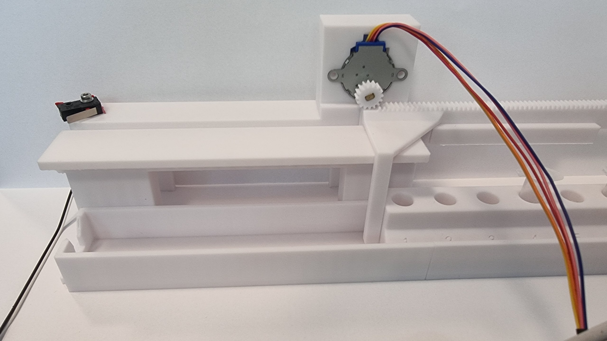

# Alignment Module

The alignment module **hosts the samples and indexes them under the dispensing
nozzle**. It is one of the core mechanical subsystems of the modular
point-of-care liquid dispenser. It does *not* move the dispensing head — it
moves the samples.

> This is a **built and bench-tested** prototype. V2 proved the mechanism; V2.1
> adds a homing microswitch and the firmware that uses it, which is what turns an
> open-loop stage into one that knows where it is.

---

## ▣ Version status

| Version | State | Where |
|---------|-------|-------|
| 🟩 **V2** | **BUILT ✅** — single rack, rack-and-pinion stage, gravity-protected layout. Indexes reliably. | §1–§4 |
| 🟩 **V2.1** | **BUILT + BENCH-VALIDATED ✅ (2026-07-31)** — homing microswitch added, three-pass homing, repeatable zero measured at **≤ 0.03 mm**, 132 mm home in **22 s**. Axis 1 only. | §5–§8 |
| **V3** | **BUILT, run on the assembled instrument (thesis chapter 12)**: two-axis chassis about 500 mm long in three printed sections, 309 mm active stroke, four-rack input queue, motorless fishbone ejection, 40-tube unattended batch. Supersedes the "not started" and "pending" remarks below. | §13 to §22 |

---

## 1. Purpose

- **Hosts the samples.** Samples arrive in microcentrifuge tubes (1.5 or 2 mL),
  stored in a **custom-made rack of 8**.
- **Designed to integrate with Pulkit's tube opener** — the wide spacing between
  sample positions exists specifically so the tube-opener mechanism can fit.
- **Eases transport.** The rack holds the samples together so a whole set can be
  moved and loaded at once.
- **Indexes under the nozzle.** The system moves the rack so each tube can be
  placed, in turn, under the dispensing module that delivers the liquid.

---

## 2. Targets & pass criteria

| Quantity | Target | Status |
|----------|--------|--------|
| **Positioning repeatability** | Sub-millimetre — the nozzle must land inside a tube mouth every time | ✅ **≤ 0.03 mm** measured (§8) — better than needed by more than an order of magnitude |
| **Return-to-zero after a full pattern** | Land back on the same physical zero, no cumulative drift | ✅ **0.03–0.13 mm** over three 132 mm round trips (§8) |
| **Usable stroke** | 8 positions at 22 mm pitch = **154 mm of travel** | ⚠ **NOT MET** — rail delivers ~140 mm. Six moves (132 mm) run cleanly; a seventh would push the rack off the pinion. Mechanical redesign pending (§9) |
| **Indexing time** | Fast enough not to dominate the dispensing cycle | ✅ full-length home **22 s**, down from 110 s (§7). A single 22 mm index step is ~4 s |
| **Must not disturb the rest of the system** | Sharing the control bus with the liquid-level sensor must stall neither | ✅ verified under live sensor streaming (§8) |
| **Fail safe, not silently** | A broken or disconnected endstop must halt the axis, not drive it into a hard stop | ✅ verified by severed-wire test (§8) |

---

## 3. Design priorities

The design was driven by three priorities: **cleanliness**, **compactness**, and
**safety from cross-contamination**.

### 3.1 Gravity-protected layout (spillage safety)

- The **stepper motor** (chosen for precision) and the **pusher** are mounted on
  **top** of the assembly — visible in the V2.1 photograph in §5.
- Mounting them up high keeps them **safe from spillage**: liquid travels
  **downward**, not upward, so splashes and spills cannot reach the drive train.
- The **moving parts and gear** — which are hard to clean — are therefore
  **inaccessible to liquid**. Gravity acts as the protector.
- The **pusher travels on the vertical axis**, which lets the nozzle deliver and
  dispense in a **linear** way.

---

## 4. Mechanism as built (V2.1)

A horizontal rack-and-pinion stage. The tube rack rides the moving carriage; the
motor and pinion sit on a fixed bracket above the rail, engaging a toothed rack
moulded into the carriage.

| Element | As built | Notes |
|---------|----------|-------|
| Drive | **28BYJ-48 geared stepper, 12 V variant** | Unipolar, internal reduction gearbox. Chosen for precision, and it holds position with the coils off |
| Transmission | **Rack and pinion**, pinion Ø **12.80 mm** | Printed rack integral to the carriage |
| Guidance | Printed linear rail + carriage | Single axis, horizontal |
| Endstop | **SPDT roller-lever microswitch**, at the **left** end of the rail | New in V2.1 — see §5 |
| Payload | Custom rack, **8 tube positions**, 1.5 / 2 mL microcentrifuge tubes | 22 mm pitch |
| Available stroke | **~140 mm** | Short of the 154 mm the 8-position pattern needs — see §9 |

### 4.1 Resolution

The motor delivers **4096 half-steps per output revolution**. One pinion
revolution advances the rack by its circumference:

```
π × 12.80 mm ≈ 40.2 mm per revolution
4096 half-steps ÷ 40.2 mm ≈ 101.9 → 102 half-steps per mm
```

So **one half-step ≈ 0.0098 mm (~10 µm)**.

**Measured and confirmed exact (2026-07-31):** 13 464 half-steps commanded,
**132 mm** measured against a rule → **102.0 half-steps/mm**. The calculated
figure and the physical one agree to the precision of the measurement.

The driver is a Darlington array with no current control, so **half-stepping is
the finest the drive can do** — there is no microstepping available on this axis.
At ~10 µm per half-step, that is not a limitation for this application.

### 4.2 Direction convention

**The endstop is on the left.** Positive step counts move the carriage **right**,
away from the switch; negative counts move it **left**, toward the switch.
Established physically on the bench, not assumed.

---

## 5. Homing — the microswitch (new in V2.1)



*V2.1 on the bench: the roller-lever microswitch at the left end of the rail
(wire exiting left), the 28BYJ-48 on its bracket above with the white pinion
engaging the printed rack, and the 8-position tube rack on the moving carriage.*

### 5.1 Why an endstop at all

Without one, the stage only knows *relative* position — it counts steps from
wherever it happened to be at power-up. Every dispensing sequence would need the
operator to place the carriage by hand first, and any missed step would silently
corrupt every position afterwards with no way to recover. The microswitch gives
the axis a **physical zero it can find by itself**, at boot and after any fault.

### 5.2 Switch choice and fail-safe wiring

The switch is **SPDT** (three terminals). The pair used is the one that reads
**closed when the lever is at rest** — the normally-closed pair — with the
controller's internal pull-up enabled:

| Lever | Contact | Pin reads | Meaning |
|-------|---------|-----------|---------|
| Free | Closed → pin pulled to ground | **LOW** | Not at endstop |
| Pressed | Open → pull-up wins | **HIGH** | **At endstop** |

**This polarity is deliberate.** A severed, unplugged or broken endstop wire is
electrically indistinguishable from "pressed", so the axis reads *at endstop* and
homing halts immediately — rather than driving the carriage into a hard stop
while waiting for a signal that will never arrive. Normally-open wiring would
fail the other way, which is the dangerous direction.

There is **no software inversion flag**. A miswired switch is meant to surface as
a wrong reading and be fixed in the wiring, not silently corrected in firmware.

### 5.3 Debounce

A reading is trusted only after **3 consecutive identical samples** — roughly
15 ms of agreement at the control loop's sampling cadence, enough to reject
microswitch bounce. A bounce accepted on the fast approach would latch a zero
several millimetres early, and every later position would inherit that error.

### 5.4 The three-pass homing sequence

Homing is deliberately not a single move. It is fast where speed is free and slow
only where precision is actually produced:

| Pass | Direction | Speed / mode | Purpose |
|------|-----------|--------------|---------|
| **1 — Fast approach** | Toward the switch | **Full-step**, fast | Pure travel. Nothing precise happens until the switch trips, so this pass buys torque and halves the control traffic per mm |
| **2 — Back-off** | Away from the switch | **Full-step**, fixed **400 half-steps ≈ 3.9 mm** | Release the switch and clear the carriage from it |
| **3 — Slow re-approach** | Toward the switch | **Half-step**, ~4× slower | **The only place the zero is set** |

**Why the third pass exists.** The repeatability of the zero is set by how far the
carriage coasts past the trigger point between two samples. On the fast pass that
coast is several tenths of a millimetre; on the slow pass it is a couple of
half-steps. Approaching slowly and only *then* zeroing is what makes the zero
repeatable rather than merely present.

Starting with the lever already pressed is legal — the sequence falls through to
the back-off pass with no special case.

### 5.5 Fault behaviour

Every failure mode stops the axis and reports, rather than continuing:

| Condition | Result |
|-----------|--------|
| Fast approach exhausts its **travel budget of 20 000 half-steps (~196 mm)** without finding the switch | Halt, coils de-energised, homed flag stays false, fault reported |
| Switch **still reads triggered after the 3.9 mm back-off** (stuck switch or severed wire) | Halt, fault reported |
| Slow re-approach exhausts its **500 half-step budget** without re-triggering | Halt, fault reported |

The travel limit is counted **in steps, not in wall-clock time** — a slow axis is
not a faulty one, and a time-based limit would fault a healthy long move.

---

## 6. Electronics and control path

The alignment axes sit **behind an I²C port expander** and consume **zero
controller GPIO pins**. This was a deliberate architectural decision: the
controller's remaining pins are reserved for pumps 3–6, so alignment was routed
through the expander from day one and a direct-GPIO draft was written and
discarded for exactly that reason.

| Element | As built |
|---------|----------|
| Expander | **MCP23017** 16-bit I/O expander at address `0x20`, on the shared I²C bus |
| Pin usage | **10 of 16** — 4 coil lines per axis (8 total) + 1 endstop input per axis (2). Six spare |
| Motor driver | **ULN2003** Darlington array board, one per axis |
| Motor supply | **12 V rail** — the same rail the pumps and the controller board already use, so alignment adds no converter |
| Current | ≈ **60 mA per energised coil** at 12 V (~200 Ω/phase); ≈60–120 mA per axis while stepping. Well inside the driver's 500 mA/channel rating |
| Endstop inputs | Expander inputs with internal pull-ups enabled |

### 6.1 Power-on safety is passive

Every controller pin is high-impedance until firmware drives it, and the expander
is not initialised until late in the boot sequence. What guarantees no coil is
energised in that window is **passive, not firmware**: **10 kΩ pull-downs on all
eight driver inputs**, plus the expander's own reset state (all pins inputs). A
100 nF decoupling capacitor across the expander's supply pins prevents
intermittent bus errors under motor load.

### 6.2 Coils park after every move

The coils are de-energised on **every** exit path — normal completion, fault,
abort, refusal, and start-up. A 28BYJ-48 left energised heats up, and the gearbox
already holds position without holding current. **Parking is the thermal design,
not politeness.**

### 6.3 Interlocks

- **One axis at a time.** A second move while one is running is *refused*, not
  queued.
- **A move toward an already-triggered endstop stops on the switch, not on the
  step count.** Moves *away* from a triggered switch are never blocked — that is
  how the operator recovers from a pressed switch.
- The endstop is sampled **before every single step**, so the interlock reacts
  within a burst of steps rather than between control-loop passes.

### 6.4 Console commands

Bench bring-up is driven from a serial console:

| Command | Effect |
|---------|--------|
| `AXIS?` | Status for both axes — expander present, homed flag, position in half-steps and mm, live endstop reading, active mode, steps remaining, and the compiled-in constants |
| `AXIS <1\|2> <steps>` | Signed half-step move. Negative = toward the endstop, positive = away. Magnitude clamped to the travel budget |
| `AXIS STOP` | Abort the moving axis and park its coils |
| `HOME <1\|2>` | Run the three-pass homing sequence. On success, position zeroes and the homed flag sets |

---

## 7. Motion performance

The first working version homed 132 mm in **110 seconds** — usable, but slow
enough to dominate a dispensing cycle. Three changes took it to **22 seconds**:

| Change | What it addressed |
|--------|-------------------|
| **Burst stepping** | The real ceiling was not the bus at all — it was the control loop's own cadence, which stepped once per pass and then waited. Stepping a batch per pass amortises that overhead away |
| **Bus clock 100 → 400 kHz** | Per-step bus traffic (one coil write + one endstop read) fell from ~700 µs to ~175 µs |
| **Full-stepping the travel passes** | Half the bus transactions per mm, and it lands only on the double-coil states, which produce more torque |

| Metric | Original | After burst stepping | Final |
|--------|---------:|---------------------:|------:|
| Homing travel, per half-step | 8.00 ms | 2.32 ms | **0.89 ms** (9× faster) |
| Dispensing move, per half-step | 8.00 ms | 2.32 ms | **1.79 ms** (4.5× faster) |
| Slow re-approach | ~25 ms | ~25 ms | **~24 ms** — unchanged *by design* |
| **Full 132 mm home** | **110 s** | 42 s | **22 s** |

**No steps were lost** at the final settings (§8).

**Where the remaining 22 s goes:** 12 s travel, 0.3 s back-off, **9.5 s slow
crawl**. The crawl exists only to re-cross the 3.9 mm back-off, so shortening the
back-off cuts it almost proportionally — but that needs one measurement first:
**how far the carriage must actually retreat before the switch releases.** Below
that, the floor is mechanical: this motor through this pinion runs out of usable
speed around **16–20 RPM**, so a full-length home cannot go much below **~13 s**
without different gearing.

---

## 8. Bench validation (2026-07-31, axis 1)

Hardware under test: one motor, one driver board, one microswitch. **Axis 2 was
never wired** — it is a wiring duplicate of axis 1 on the next four expander pins
through the same code path, so proving axis 1 proves the design, but not that
particular motor, driver board or switch.

| # | Question | Result |
|---|----------|--------|
| a | Expander and liquid-level sensor both answer on the shared bus? | ✅ Both present. Adding the expander did not disturb the sensor |
| b | Endstop reads correctly at rest and pressed? | ✅ Lever free → *free*; carriage driven into switch → *at endstop* |
| c | Direction of positive steps | ✅ **Positive = right = away from the switch**; switch is on the left |
| d | Coils park after a move? | ✅ All four driver indicator LEDs off at rest |
| e | Homing pass counts (fast / back-off / slow) | ✅ **1890 / 400 / 400** half-steps |
| f | **Homing repeatability**, three runs from different offsets | ✅ **Spread 2 half-steps ≈ 0.02 mm.** Commanded 800 / 1500 / 1100 → counted 800 / 1502 / 1100 |
| g | **Return-to-zero accuracy**, three 132 mm round trips at final speed | ✅ Commanded **13 464** out; homing counted **13 470 / 13 467 / 13 477** back = **+0.06 / +0.03 / +0.13 mm**. **No step loss** |
| h | Shared-bus stress: home while the liquid-level sensor streams | ✅ **No stall.** 75 sensor readings, every one 0.47–0.55 s apart against a 500 ms target, throughout all three homing passes. Homing landed **0.05 mm** from target. Step interval stretched 8.00 → 8.11 ms (**1.6 %**). Re-verified twice more after the speed work |
| i | **Severed-wire control** — endstop unplugged, then home | ✅ Correct fault reported; carriage **moved 3.9 mm and stopped, in 3.2 s** |
| j | Half-steps per mm vs the calculated 102 | ✅ **Exact** — 13 464 half-steps → 132 mm measured = **102.0 /mm** |
| k | Control loop alive, no resets during a move | ✅ Touchscreen kept rendering and responded to taps throughout |
| l | Travel-budget fault, negative control | ⛔ **NOT RUN** — see §9 |
| m | Rail voltage under load; coil resistance of both motors | — **not measured** (needs a multimeter) |

### 8.1 Honest limit on the repeatability figure

The measured spread is 2 half-steps ≈ 0.02 mm, but the debounce filter needs 3
consecutive agreeing samples, which is ~3 half-steps of travel. **The measurement
is therefore sitting at the resolution floor of the method.** The defensible claim
is **"no worse than ~0.03 mm"**, not "0.02 mm exactly". Either way it is
sub-millimetre by more than 30×.

### 8.2 A diagnostic that lied

Mid-session, the status command was found to report **stale** endstop readings: it
printed whatever the debounce filter had last latched, and the filter is only fed
while an axis is moving. At rest it reported the *previous move's* value. Caught
during the severed-wire test — with the endstop physically disconnected, the
status command reported *free*, the exact opposite of the truth.

**The hardware was behaving perfectly; the diagnostic was lying.** Fixed the same
day — the status command now takes a fresh debounced sample before printing. Any
endstop reading recorded before 2026-07-31 is invalid.

### 8.3 A discarded result

One mid-session set of round trips degraded badly and looked like a rack
derailment. It was **contaminated** — the rig was moved and the trigger touched
mid-run — and has been discarded in full. It survives only as the untested
derailment-detection idea in §9.

---

## 9. Open questions & risks

**⚠ 1 — The stroke is ~14 mm too short.** The 8-position pattern needs
**7 moves × 22 mm = 154 mm**; the rail provides **~140 mm**. Six moves (132 mm)
run cleanly and repeatably; a seventh would push the rack off the pinion, so the
full sequence was deliberately not attempted. **Decision: redesign the affected
parts to a >170 mm stroke.** This is **mechanical only** — the electronics, the
firmware and the control logic are unaffected by the geometry change, and the
firmware travel budget is already set to 196 mm to accommodate it.

**⚠ 2 — Homing has no derailment check (proposal, untested).** If the rack jumps
the pinion, the motor keeps stepping while the carriage does not move, and nothing
currently notices. A return-home whose fast-approach count disagrees with the
commanded outward travel would detect exactly that, cheaply, using numbers the
firmware already has. **Recorded as an idea, not a finding** — the one session
that appeared to show it was contaminated (§8.3). Needs a deliberate test before
anything relies on it.

**3 — The travel-budget fault has never fired on hardware.** The negative control
was skipped by operator decision: the budget is a firmware constant rather than a
property of the axis, and running it would have ground the carriage against a hard
stop for over a minute. The fault path is **code-reviewed only**. Re-scoping it
needs the motor decoupled from the rail.

**4 — Axis 2 has never been wired or energised.** No endstop reading, no homing
counts, no direction sense, no repeatability. Give it one status check and one
homing run the first time it is wired.

**5 — Unmeasured electrical values.** Rail voltage at the driver under load, and
the coil resistance of both motors, were not measured (both need a multimeter). It
is therefore confirmed *by behaviour, not by meter*, that both motors are the 12 V
variant.

**6 — How far the carriage must retreat before the switch releases** is the one
measurement blocking a shorter back-off, and with it the largest remaining
speed-up (§7).

---

## 10. Next steps

**Mechanical (V3):**
- **Redesign the rail and carriage to a >170 mm stroke** so the full 8-position
  pattern fits with margin. Highest priority — it is the only unmet pass criterion.
- Wire and prove **axis 2**.

**Functional (future perspective):**
- Add an **input queue** and an **output queue** so the module can hold and handle
  a queue of **at least four racks**.
- Handle those racks **automatically**, for seamless, fast processing of a higher
  throughput of samples.

**Verification debt:**
- Measure the switch release distance, then shorten the back-off (§9-6).
- Run the travel-budget negative control with the motor decoupled (§9-3).
- Meter the rail under load and the coil resistances (§9-5).

---

## 11. Version log

- **V2 (built 2026-06-25)** — rack-and-pinion indexing stage, gravity-protected
  layout with motor and pusher mounted above the rail. Moves one rack at a time
  and does that job well. Open-loop: no position reference. → §1–§4
- **V2.1 (built 2026-07-30, bench-validated 2026-07-31)** — **homing microswitch
  added.** SPDT roller-lever endstop at the left end of the rail, fail-safe
  normally-closed wiring, three-pass homing sequence, coil parking, step-counted
  travel limit. Driven through an I²C port expander using zero controller GPIO.
  Repeatable zero measured at **≤ 0.03 mm**; 132 mm home taken from **110 s to
  22 s** with no step loss; verified not to disturb the liquid-level sensor
  sharing the bus. Exposed and fixed a stale-reading diagnostic bug. Uncovered the
  stroke shortfall that drives the V3 redesign. → §5–§9

---

## 12. Source documents & test data

The electronics and firmware for this module live in the **Arduino/firmware
repository**, not here. That repository is authoritative for anything about the
built system; this file is the design-side record.

| What | Where |
|------|-------|
| Wiring table, pin allocation, power tree, operator checklist, bench results | Firmware repo → `Architecture/hardware.md` §4c |
| Homing state machine, phase tables, every constant with its rationale | Firmware repo → `Architecture/src/bench_align.cpp` |
| Session narrative — firmware written, bench session, speed work | Firmware repo → `Architecture/project-log.md`, entries 2026-07-30 and 2026-07-31 |
| Why the 12 V motor variant, the rail-count trade-off, and the open question of whether alignment runs at 5 V or 12 V in the ideal 24 V design | Firmware repo → `Architecture/IDEAL-DESIGN.md` — *counterfactual; describes nothing that is wired* |

**Precedence:** where the firmware repo's `hardware.md` and `IDEAL-DESIGN.md`
disagree about the built system, `hardware.md` wins. Numbers in this file are
taken from `hardware.md` and the bench session, not from the ideal design.

---

## Media

- `AlignmentModuelHomingV2.1.png` — V2.1 on the bench, homing switch fitted (§5).
- `Alignment_Module_V2.mp4` — V2 in motion (used in the lab-meeting deck).
  ⚠ ~36 MB — needs re-encoding before it can be served on a web page.

*Design iterations will continue to be documented here.*

---

# V3, the two-axis chassis

> Everything from here on concerns **V3**, the final build of this module as
> described in the thesis (chapter 7 section 7.4, chapter 11 section 11.6,
> chapter 12 sections 12.3 and 12.4, and the bench table in Appendix L).
> Sections 1 to 12 above are the V2 and V2.1 record and are left as written;
> where they say V3 is "not started" or "pending", this part supersedes them.
> The V3 page lives at `v3-two-axis-chassis/index.html`; the V2 and V2.1 page
> stays at `index.html`.

---

## 13. Concept

V2 and V2.1 proved single-axis indexing of one eight-tube rack. An unattended
diagnostic protocol needs the machine to work through several racks with nobody
swapping them between runs, so V3 adds a **second, transverse axis** and two
**queuing trays** flanking the dispensing lane (thesis 7.4). The module grows into
a platform roughly **500 mm** long that sets the physical envelope of the whole
instrument and becomes the **structural chassis** the other subsystems mount to
(7.4, 7.4.4).

The workflow is a **U-shaped path** (7.4.1):

1. Racks are loaded into the **input queue** on the left.
2. **Axis 2** advances the queue and transfers the leading rack into the
   **dispensing lane** at the start of each cycle.
3. **Axis 1** indexes that rack left to right under the nozzle window in
   **22 mm** steps until every tube has passed beneath it.
4. At the right end of the stroke a **passive cam** ejects the finished rack
   diagonally into the **output tray**, where completed racks accumulate for
   retrieval.

The enclosed central compartment between the two trays is the **electronics
bay**: an open-topped housing with a removable front panel that holds the
microcontroller, the motor driver boards and the power distribution wiring
(7.4.1, 11.6).

---

## 14. What changed from V2.1

| | V2.1 | V3 | Thesis |
|---|---|---|---|
| Axes | One, longitudinal | Two: axis 1 longitudinal indexing, axis 2 transverse queue feed | 7.4.1 |
| Usable stroke on axis 1 | ~140 mm, six index moves, short of the 154 mm the eight-position pattern needs (the one unmet criterion in section 2) | **309 mm** active stroke: complete eight-position indexing plus the ejection stroke | 7.3.3, 7.4.1 |
| Racks per run | One, placed by hand | **Five** (four queued, one pre-loaded on the lane), **40 tubes** | 7.4.1 |
| Rack hand-off | Manual | Axis 2 feeds in; a motorless fishbone cam ejects out | 7.4.1, 7.4.2 |
| Chassis | One printed rail and carriage | Three dovetail-keyed printed sections, about 500 mm overall, with the electronics bay between the trays | 7.4.3 |
| Homing | One microswitch, three-pass sequence | The same switch, the same normally-closed fail-safe loop and the same three-pass sequence, on each axis | 7.4.1 |
| Drive | 28BYJ-48 through a pinion of 12.80 mm pitch diameter | The same motor on both axes, **16-tooth** spur pinion, 3D-printed involute gear rack | 7.4.1 |
| Role in the instrument | Bench stage | Structural foundation: dovetail sockets for the pump and storage modules, a reinforced boss for the nozzle holder, a ridge that locates the display holder | 7.4.4 |

What did **not** change: the endstop wiring and the three-pass homing are the
V2.1 ones (7.4.1), and the control path in section 6 was laid out for two axes
from the start (four coil lines plus one endstop input per axis on the
expander). V3 is a mechanical scale-up around a validated drive, not a new
drive.

---

## 15. Axis 1 and axis 2

Both axes use **identical drive components**: a 28BYJ-48 geared stepper, a
16-tooth spur pinion and a 3D-printed involute gear rack. Only the **pushers**
differ, to match what each one has to push (7.4.1).

| | Axis 1 | Axis 2 |
|---|---|---|
| Direction | Longitudinal, along the dispensing lane | Transverse, through the input tray |
| Job | Index the active rack under the nozzles in 22 mm steps, then drive the ejection stroke | Advance the whole queue of waiting racks and hand the leading one into the lane |
| Pusher | Extends **downward** from an overhead gear rack mounted along the rear wall to contact the back face of the active rack | Spans the **full width** of the input tray on **two parallel legs**, so the entire queue moves at once |
| Stroke | 309 mm active | Not stated in the thesis |
| Endstop | Own microswitch, normally-closed fail-safe loop, three-pass homing | Same |
| Motor mount | Standalone bracket, aligned against the assembled rack in situ | Same |

**Axis 2 pusher redesign (7.4.3).** In the first full-scale build the long
dual-span arms of the queue pusher showed minor torsional flex under the load of
four full racks and absorbed drive displacement. The second build enlarged the
chamfer where the toothed arm meets the cross bar, a small one in the first
build and considerably deeper in the second, so the corner the load turns
through is braced and the load reaches the queue directly.

**Two decisions moved precision from CAD tolerance to the bench (7.4.3).** The
motor mounts are independent brackets rather than chassis features, so each
motor can be positioned against the assembled gear rack in situ for correct mesh
and minimal backlash. The microswitch seats are flat locating pads with no pilot
holes; the screw holes are drilled at final calibration.

**Vertical clearance (7.4.1).** The height of every side wall is set by the
tallest moving obstacle: a rack carrying open tubes with their caps standing.
That envelope is what the lid-fouling failure mode in section 19 escapes from.

---

## 16. The fishbone ejector (7.4.2)

When a rack finishes its pass at the right end of the lane it must be cleared
sideways into the output tray to make room for the next one. Three constraints
governed the mechanism:

1. **No auxiliary actuator.** Ejection had to be powered by the existing travel
   of axis 1, to keep parts count and controller outputs down.
2. **Zero stored elastic energy.** A spring-loaded kicker releases at an
   uncontrolled speed above open sample tubes: agitation and aerosol risk.
3. **Cleanability.** No pivots, hinges or slide bushings, which are particulate
   traps and fluid ingress paths.

The answer is a **passive fishbone cam track**. Two **angled ribs** protrude from
the underside of every sample rack (they were added to the rack in its final
iteration, 7.2), and two matching **angled grooves** are recessed into the rail
floor at the ejection station. When the rack completes position 8 the ribs line
up with the grooves; one more **22 mm** stroke of axis 1 forces the ribs along
the groove walls and turns longitudinal pusher travel into a smooth diagonal
slide that puts the rack in the output tray, which sits **1 mm below** the main
lane. The geometry is moulded into the structural floor and the rack body, so
there are no moving parts, springs or pivots.

Two features make the cam track reliably:

- The ribs are **elongated**, not cylindrical, giving line contact along the
  groove wall; that constrains yaw so the rack cannot cock or bind in the lane.
- The two ribs have **asymmetric widths**: the wider trailing rib bridges the
  narrower leading groove instead of dropping into it, so the rack cannot start
  ejecting during an intermediate dispensing step.

Completed racks accumulate passively. Each newly ejected rack pushes the earlier
ones forward across the low-friction floor and squares the batch against the
outer corner wall for retrieval at the end of the run. Active alternatives
(pivoting push-arms, motorised cross-shuttles, spring-loaded flippers) were
rejected at concept screening (Appendix L).

---

## 17. Chassis manufacture (7.4.3)

- **One body, three sections.** The 500 mm chassis was modelled as a single CAD
  body and split into **three** sections to fit a desktop printer. Three rather
  than two so that a change to one groove or wall reprints one third. The two
  parting planes coincide with the outer walls of the electronics bay and cross a
  plain baseline that carries no grooves, dispensing windows or retaining sills.
- **Joining.** Interlocking **dovetail keys** align the sections; **M3** screws
  driven from the rear and bottom faces clamp them; flat reinforcement plates
  bridge each seam (one at the front, two at the rear) against bending.
- **Underside.** Recessed wiring ducts run to a central port in the electronics
  bay; dedicated pockets seat the two homing microswitches; two carrying handles
  are recessed into the outer end walls for two-handed transport; a row of
  downward-opening dovetail sockets along the rear exterior wall takes the pump
  and reagent storage modules from above without external fasteners (7.4.4).
- **Print time.** About **8 hours per section**, which limited the prototyping
  cycle: only **two** full-scale build iterations were carried out. Both pushers
  were printed in two parts and joined at dovetail interfaces by localised
  thermal welding.
- **Markings.** Operator markings sit **on** the surface, never engraved: a letter
  cut into the deck is a crevice. They name the input queue, the rack lane and
  the output tray, and number the five rack slots, slot 1 on the lane and slots
  2 to 5 back along the input queue, so an operator knows which slot fills first
  and in what order the racks are drawn. On the prototype they are drawn in
  **pencil**, which lifts with the same wipe that cleans the deck; a production
  chassis would carry the same scheme printed or painted.

---

## 18. Capacity and the batch run

A standard batch is **five racks, 40 tubes**: four waiting in the input queue
and one pre-loaded directly on the lane, which buys capacity without extra tray
depth. The operator sets the number of racks and the tubes per rack on the
touchscreen (7.4.1).

On the assembled instrument (11.6) the chassis is the anchor: input queue left,
output tray right, the two pump and storage carriers on the rear wall, the
nozzle holder above the lane, the touchscreen at centre front on the electronics
bay, the battery at front left. The assembled machine measures **50 cm wide,
35 cm deep and 18 cm high**; its mass has not been weighed and is estimated at
about **4 kg** with four racks loaded.

Run sequence (11.6): load racks into the input queue, select recipes and assign
them to tube positions, pre-run reagent-level check, home the axes if not
already referenced, axis 2 draws the first rack onto the lane, axis 1 indexes
each tube under the nozzles, the pump delivers and a vibration burst detaches
the droplet, the finished rack is ejected to the output tray and the next one
drawn in.

---

## 19. Validation results that concern alignment

| Check | Result | Thesis |
|---|---|---|
| Full batch, unattended | **Five racks, 40 tubes**, two-reagent recipe (100 µL and 75 µL), run from start to finish with no operator help, on the bench DC supply | 12.3, 12.4 |
| Placement | Across the 40 tubes the droplets hit the tube openings within the **5 mm** landing tolerance: **all 40 tubes hit** | 12.3 |
| Off-target | **Three droplets** showed partial wetting on the rack deck or lane; no dye reached the bench or the operator | 12.3, 12.5 |
| Volume across racks | Tubes lifted from the first and the last rack held visually comparable volumes | 12.3 |
| Axis speed | Both linear axes were **slowed** so the steppers had the strength to push the loaded five-rack magazine without stalling; a small delay per cycle | 12.4 |
| Battery run | The 12 V tool battery carried **two full racks (16 samples)**; then, as it drained, running both pumps at once stalled them and the run had to stop because the firmware cannot run one pump at a time. A power limit, not an alignment failure | 12.4 |
| Qualification on the two-axis chassis | The multi-pass bench protocol of section 8 was **repeated on the assembled chassis** under integrated firmware; both axes gave reliable queue feeding, precise indexing and automated ejection across repeated full batch sequences. **No numeric V3 results are published**; the figures on record remain the V2.1 bench numbers of 31 July 2026 | 7.4.1, 7.3.3, Appendix L |
| Known failure mode: lids | A lid pushed flat to **180°** projects sideways and reaches the **45°** chamfered wall beside the lane. The friction cannot be sensed on an open-loop axis: the motor completes its steps, the rack lags, the firmware believes the position was reached, and the dose lands beside the tube. **Observed on the assembled instrument.** A lid folded back to about **135°** stands clear. Operating instruction: fold every cap to 135°, avoid lateral cap overlap, keep rack clearance | 7.4.1, 12.3 |

The bench repeatability figure (no worse than ~0.03 mm, section 8) bounds the
**drive, not the rack**: it says how faithfully the carriage follows its step
count when nothing obstructs it. External friction on the rack leaves the count
intact while the rack falls short (7.3.3).

---

## 20. Open gaps

1. **Lid fouling remedies are not built.** Two are named (7.4.1): reshape the wall
   profile, which is chamfered at 45° on the built chassis, and a firmware check
   that compares the step count on the return home against the commanded outward
   travel. The second is the section 9 derailment idea, still untested.
2. **No V3-specific numbers.** Repeatability, return-to-zero and timing were not
   re-measured and published for either axis on the two-axis chassis; axis 2
   still has no bench number of its own. Its stroke is not stated either.
3. **Battery batches above 16 samples** need one-pump-at-a-time firmware, and the
   machine has no battery monitor or low-battery lockout (12.4).
4. **Two full-scale builds only.** The axis-2 pusher redesign is proven by the
   batch runs, not by a dedicated flex measurement.
5. **Mass is an estimate**, about 4 kg, not a weighed value (11.6).
6. **Production items**: automatic cap opening removes the manual cap handling the
   prototype depends on (12.3); printed or painted markings (7.4.3); sliding
   labyrinth covers for the motors and an enclosure for the whole machine (7.3.2,
   11.6).
7. **The V2.1 verification debt in section 9 is still open**: the travel-budget
   fault has not fired on hardware, coil resistance and rail voltage are not
   metered, the switch release distance is not measured.

---

## 21. Version log addendum

- **V3 (two full-scale builds; run on the assembled instrument, thesis chapter
  12)**: two-axis chassis about 500 mm long in three dovetail-keyed printed
  sections, 309 mm active stroke on axis 1, transverse axis 2 feeding a
  four-rack input queue, motorless fishbone-cam ejection into an output tray,
  electronics bay between the trays, dovetail sockets and a nozzle boss that make
  the chassis the instrument's structural foundation. Closes the stroke shortfall
  that was the only unmet criterion of V2.1. Validated by an unattended
  five-rack, 40-tube batch with every tube hit and three droplets partly on the
  rack; one known failure mode, lost steps when a flat lid rubs the lane wall.
  → §13 to §20

---

## 22. V3 sources and media

| What | Where |
|------|-------|
| Concept, axes, queuing, capacity, lid fouling | Thesis chapter 7, section 7.4.1 |
| Fishbone ejector | Thesis 7.4.2 |
| Three-section chassis, brackets, switch seats, markings | Thesis 7.4.3 |
| Dovetail sockets, nozzle boss | Thesis 7.4.4 |
| The integrated prototype, envelope, run sequence | Thesis 11.6 |
| 40-tube run, placement, lid failure mode | Thesis 12.3 |
| Unattended run, slowed axes, battery run | Thesis 12.4 |
| Bench qualification table (V2.1 figures that V3 inherits) | Thesis Appendix L, bench qualification of the indexing stage |

Media for the V3 page, all under `assets/media/alignment/` at the repo root:
`v3-iso.png`, `v3-top.png`, `v3-bottom.png`, `v3-top-annotated.png`,
`v3-bottom-annotated.png`, `rack.png`, `pusher-axis-1.png`, `pusher-axis-2.png`,
`v3-markings.jpg`, `v3-left-end.jpg`, `lid-fouling.jpg`; the two batch-run
photographs `validation-start.jpg` and `validation-done.jpg` under
`assets/media/device/`. The V2 clip now exists re-encoded at
`assets/media/video/alignment-v2.mp4` (about 1.4 MB, with a poster), which
supersedes the media note above. **No clip of V3 in motion exists**; the V3 page
shows the V2 stage and says so.
